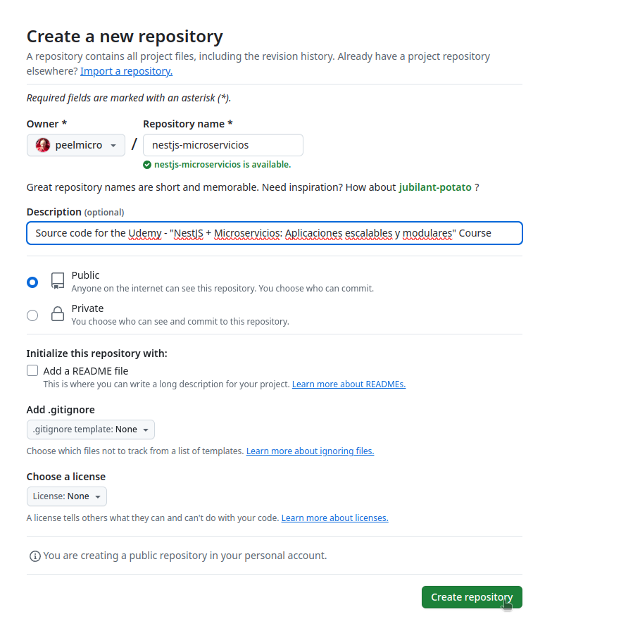
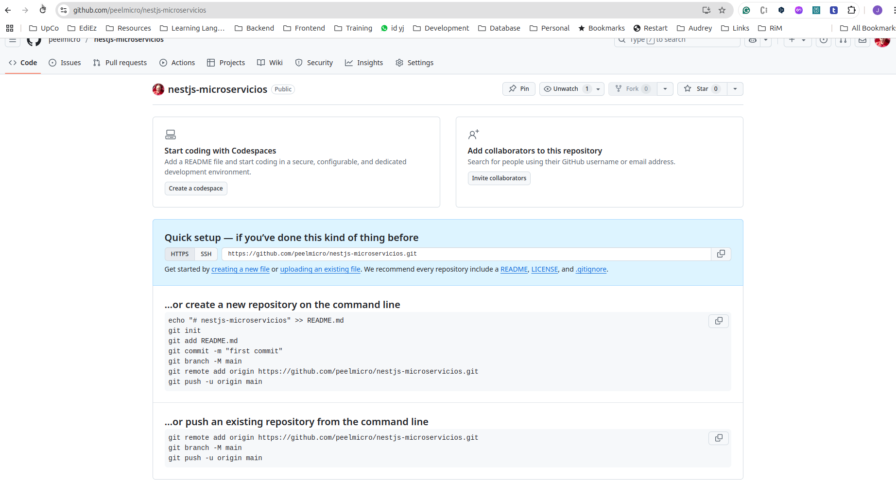

# NestJS + Microservicios: Aplicaciones escalables y modulares

- En este documento vamos a documentar el curso [NestJS + Microservicios: Aplicaciones escalables y modulares de Udemy](https://www.udemy.com/course/nestjs-microservicios)

## 01. Reforzamiento de conceptos básicos de NestJS

### 01.1. Crear un nuevo proyecto NestJS

#### 01.1.1. Crear un nuevo proyecto NestJS usando el comando `nest new`

- Tenemos que crear un nuevo proyecto NestJS. Para ello, ejecutamos el siguiente comando:

```bash
nest new products
✨  We will scaffold your app in a few seconds..

✔ Which package manager would you ❤️ to use? npm
CREATE products/.prettierrc (51 bytes)
CREATE products/README.md (5020 bytes)
CREATE products/eslint.config.mjs (856 bytes)
CREATE products/nest-cli.json (171 bytes)
CREATE products/package.json (2034 bytes)
CREATE products/tsconfig.build.json (97 bytes)
CREATE products/tsconfig.json (544 bytes)
CREATE products/src/app.controller.ts (274 bytes)
CREATE products/src/app.module.ts (249 bytes)
CREATE products/src/app.service.ts (142 bytes)
CREATE products/src/main.ts (228 bytes)
CREATE products/src/app.controller.spec.ts (617 bytes)
CREATE products/test/jest-e2e.json (183 bytes)
CREATE products/test/app.e2e-spec.ts (674 bytes)

✔ Installation in progress... ☕

🚀  Successfully created project products
👉  Get started with the following commands:

$ cd products
$ npm run start

                                         
                          Thanks for installing Nest 🙏
                 Please consider donating to our open collective
                        to help us maintain this package.
                                         
                                         
               🍷  Donate: https://opencollective.com/nest
```

- Una vez creado el proyecto, debemos crear la carpeta `01-Reforzamiento` y mover el directorio `products` creado por el comando anterior.

```bash
mkdir 01-Reforzamiento
mv products 01-Reforzamiento/
```

#### 01.1.2. Asegurarnos de que el proyecto está funcionando

- Para asegurarnos de que el proyecto está funcionando, ejecutamos el siguiente comando:

```bash
npm run start

> products@0.0.1 start
> nest start

[Nest] 348262  - 02/04/2025, 12:35:55     LOG [NestFactory] Starting Nest application...
[Nest] 348262  - 02/04/2025, 12:35:55     LOG [InstanceLoader] AppModule dependencies initialized +6ms
[Nest] 348262  - 02/04/2025, 12:35:55     LOG [RoutesResolver] AppController {/}: +3ms
[Nest] 348262  - 02/04/2025, 12:35:55     LOG [RouterExplorer] Mapped {/, GET} route +1ms
[Nest] 348262  - 02/04/2025, 12:35:55     LOG [NestApplication] Nest application successfully started +2ms
```

#### 01.1.3. Vamos a crear un resource para el controlador de productos

- Vamos a crear un resource para el controlador de productos. Para ello, ejecutamos el siguiente comando:

```bash
nest g resource products
✔ What transport layer do you use? REST API
✔ Would you like to generate CRUD entry points? Yes
CREATE src/products/products.controller.spec.ts (596 bytes)
CREATE src/products/products.controller.ts (957 bytes)
CREATE src/products/products.module.ts (269 bytes)
CREATE src/products/products.service.spec.ts (474 bytes)
CREATE src/products/products.service.ts (651 bytes)
CREATE src/products/dto/create-product.dto.ts (33 bytes)
CREATE src/products/dto/update-product.dto.ts (181 bytes)
CREATE src/products/entities/product.entity.ts (24 bytes)
UPDATE package.json (2067 bytes)
UPDATE src/app.module.ts (207 bytes)
✔ Packages installed successfully.
```

#### 01.1.4. Añadir el prefijo `api` a todas las rutas

- Añadir el prefijo `api` a todas las rutas. Para ello, modificamos el archivo `src/main.ts`
- También vamos a añadir la validación de DTOs:

```diff
import { NestFactory } from '@nestjs/core';
import { AppModule } from './app.module';
+import { ValidationPipe } from '@nestjs/common';

async function bootstrap() {
  const app = await NestFactory.create(AppModule);
+ app.setGlobalPrefix('api');
+ app.useGlobalPipes(  
+   new ValidationPipe({ 
+     whitelist: true, 
+     forbidNonWhitelisted: true, 
+   }) 
+ );
  await app.listen(process.env.PORT ?? 3000);
}
bootstrap();
```

- Podemos ver que el prefijo `api` se ha añadido a todas las rutas.

```bash
[Nest] 377207  - 02/04/2025, 12:56:03     LOG [NestFactory] Starting Nest application...
[Nest] 377207  - 02/04/2025, 12:56:03     LOG [InstanceLoader] AppModule dependencies initialized +6ms
[Nest] 377207  - 02/04/2025, 12:56:03     LOG [InstanceLoader] ProductsModule dependencies initialized +1ms
[Nest] 377207  - 02/04/2025, 12:56:03     LOG [RoutesResolver] ProductsController {/api/products}: +3ms
[Nest] 377207  - 02/04/2025, 12:56:03     LOG [RouterExplorer] Mapped {/api/products, POST} route +2ms
[Nest] 377207  - 02/04/2025, 12:56:03     LOG [RouterExplorer] Mapped {/api/products, GET} route +1ms
[Nest] 377207  - 02/04/2025, 12:56:03     LOG [RouterExplorer] Mapped {/api/products/:id, GET} route +0ms
[Nest] 377207  - 02/04/2025, 12:56:03     LOG [RouterExplorer] Mapped {/api/products/:id, PATCH} route +1ms
[Nest] 377207  - 02/04/2025, 12:56:03     LOG [RouterExplorer] Mapped {/api/products/:id, DELETE} route +0ms
[Nest] 377207  - 02/04/2025, 12:56:03     LOG [NestApplication] Nest application successfully started +2ms
```

#### 01.1.5. Añadir los paquetes `class-validator` y `class-transformer`

```bash
npm i class-validator class-transformer

added 5 packages, and audited 810 packages in 2s

147 packages are looking for funding
  run `npm fund` for details

found 0 vulnerabilities
```

#### 01.1.6. Añadir la validación de DTOs

> 01-Reforzamiento/products/src/products/dto/create-product.dto.ts

```typescript
import { Type } from 'class-transformer';
import { IsNumber, IsOptional, IsString } from 'class-validator';

export class CreateProductDto {

  @IsString()
  name: string;

  @IsString()
  @IsOptional()
  description?: string;

  @IsNumber()
  @Type( () => Number )
  price: number;

}
```

> 01-Reforzamiento/products/src/products/dto/update-product.dto.ts

```typescript
import { PartialType } from '@nestjs/mapped-types';
import { CreateProductDto } from './create-product.dto';
import { IsOptional, IsString, IsUUID } from 'class-validator';

export class UpdateProductDto extends PartialType(CreateProductDto) {

  @IsString()
  @IsUUID()
  @IsOptional()
  id?: string;

}
```

#### 01.1.7. Añadir el paquete `uuid`

```bash
npm i uuid

added 1 package, and audited 811 packages in 1s

148 packages are looking for funding
  run `npm fund` for details

found 0 vulnerabilities
```

```bash
npm i -D @types/uuid

added 1 package, and audited 812 packages in 987ms

148 packages are looking for funding
  run `npm fund` for details

found 0 vulnerabilities
```

#### 01.1.8. Completar el Product Entity

> 01-Reforzamiento/products/src/products/entities/product.entity.ts

```typescript
interface UpdateWithOptions {
  name?: string;
  description?: string;
  price?: number;
}

export class Product {
  constructor(
    public id: string,
    public name: string,
    public description: string | undefined,
    public price: number,
  ) {}

  updateWith({ name, description, price }: UpdateWithOptions) {
    this.name = name ?? this.name;
    this.description = description ?? this.description;
    this.price = price ?? this.price;
  }
}
```

#### 01.1.9. Completar el servicio de productos

> 01-Reforzamiento/products/src/products/products.service.ts

```typescript
import { Injectable, NotFoundException } from '@nestjs/common';
import { v4 as UuidV4  } from 'uuid';


import { CreateProductDto } from './dto/create-product.dto';
import { UpdateProductDto } from './dto/update-product.dto';

import { Product } from './entities/product.entity';


@Injectable()
export class ProductsService {

  private products: Product[] = [];

  create(createProductDto: CreateProductDto) {
    const { name, description, price } = createProductDto;

    const newProduct = new Product(
      UuidV4(),
      name, 
      description, 
      price,
    );

    this.products.push(newProduct);
    return newProduct;

  }

  findAll() {
    return this.products;
  }

  findOne(id: string): Product {
    const product = this.products.find( product => product.id === id );

    if ( !product ) {
      throw new NotFoundException(`Product with id ${ id } not found`);
    }

    return product;
    
  }

  update(id: string, updateProductDto: UpdateProductDto) {
    
    const { id:__, name, description, price } = updateProductDto;

    const product = this.findOne( id );

    product.updateWith({ name, description, price });

    return product;

  }

  remove(id: string): Product {

    const product = this.findOne(id);
    this.products = this.products.filter( product => product.id !== id );
    return product;

  }
}
```

#### 01.1.10. Completar el controlador de productos

> 01-Reforzamiento/products/src/products/products.controller.ts

```typescript
import { Controller, Get, Post, Body, Patch, Param, Delete, ParseUUIDPipe } from '@nestjs/common';
import { ProductsService } from './products.service';
import { CreateProductDto } from './dto/create-product.dto';
import { UpdateProductDto } from './dto/update-product.dto';

@Controller('products')
export class ProductsController {
  constructor(private readonly productsService: ProductsService) {}

  @Post()
  create(@Body() createProductDto: CreateProductDto) {

    return this.productsService.create(createProductDto);
  }

  @Get()
  findAll() {
    return this.productsService.findAll();
  }

  @Get(':id')
  findOne(@Param('id', ParseUUIDPipe ) id: string) {
    return this.productsService.findOne(id);
  }

  @Patch(':id')
  update(
    @Param('id', ParseUUIDPipe ) id: string,
    @Body() updateProductDto: UpdateProductDto) 
  {
    return this.productsService.update(id, updateProductDto);
  }

  @Delete(':id')
  remove(@Param('id', ParseUUIDPipe ) id: string) {
    return this.productsService.remove(id);
  }
}
```

#### 01.1.11. Añadir variables de entorno sin usar `ConfigService`

- Vamos a añadir las variables de entorno sin usar `ConfigService`

- Tenemos que instalar el paquete `dotenv`

```bash
npm i dotenv

added 1 package, and audited 813 packages in 2s

149 packages are looking for funding
  run `npm fund` for details

found 0 vulnerabilities
```

- Añadir el archivo `.env` en el directorio `01-Reforzamiento/src/config`

- También vamos a instalar el paquete `joi` para validar las variables de entorno

```bash
npm i joi

added 6 packages, and audited 819 packages in 1s

149 packages are looking for funding
  run `npm fund` for details

found 0 vulnerabilities
```

- Añadir el archivo `envs.ts` en el directorio `01-Reforzamiento/products/src/config`

> 01-Reforzamiento/products/src/config/envs.ts

```typescript
import 'dotenv/config';
import joi from 'joi';

interface EnvVars {
  PORT: number;
}

const envsSchema = joi
  .object({
    PORT: joi.number().required(),
  })
  .unknown(true);

const { error, value } = envsSchema.validate(process.env);

if (error) {
  throw new Error(`Config validation error: ${error.message}`);
}

const envVars: EnvVars = value;

export const envs = {
  port: envVars.PORT,
};
```

- Añadir el archivo `.env` en el directorio `01-Reforzamiento/products`

> 01-Reforzamiento/products/.env

```text
PORT=3000
```

- Modificar el archivo `main.ts` para que use las variables de entorno

> 01-Reforzamiento/products/src/main.ts

```diff
import { NestFactory } from '@nestjs/core';
import { AppModule } from './app.module';
import { ValidationPipe } from '@nestjs/common';
+import { envs } from './config/envs';

async function bootstrap() {
  const app = await NestFactory.create(AppModule);
  app.setGlobalPrefix('api');
  app.useGlobalPipes(  
    new ValidationPipe({ 
      whitelist: true, 
      forbidNonWhitelisted: true, 
    }) 
  );
- await app.listen(process.env.PORT ?? 3000);
+ await app.listen( envs.port );
+ console.log(`Server running on port ${ envs.port }`);  
}
bootstrap();
```

#### 01.1.12. Crear un nuevo repositorio de GitHub

- Inicializar el directorio nestjs-microservicios como un nuevo repositorio de GitHub

```bash
~/Training/microservices/nestjs-microservicios$
git init
hint: Using 'master' as the name for the initial branch. This default branch name
hint: is subject to change. To configure the initial branch name to use in all
hint: of your new repositories, which will suppress this warning, call:
hint: 
hint:   git config --global init.defaultBranch <name>
hint: 
hint: Names commonly chosen instead of 'master' are 'main', 'trunk' and
hint: 'development'. The just-created branch can be renamed via this command:
hint: 
hint:   git branch -m <name>
Initialized empty Git repository in /home/juanpabloperez/Training/microservices/nestjs-microservicios/.git
```

- Podemos cambiar el nombre de la branch por defecto a `main`

```bash
git branch -M main
git status
On branch main

No commits yet

Untracked files:
  (use "git add <file>..." to include in what will be committed)
        01-Reforzamiento/
        doc/

nothing added to commit but untracked files present (use "git add" to track)
```

- Añadir el repositorio `nestjs-microservicios` en GitHub



- El repositorio remoto ya está creado, por lo que solo tenemos que añadirlo



- Añadir el repositorio remoto

```bash
git remote add origin https://github.com/juanpabloperez/nestjs-microservicios.git
```

- Añadir el repositorio remoto

```bash
git remote add origin https://github.com/juanpabloperez/nestjs-microservicios.git
```