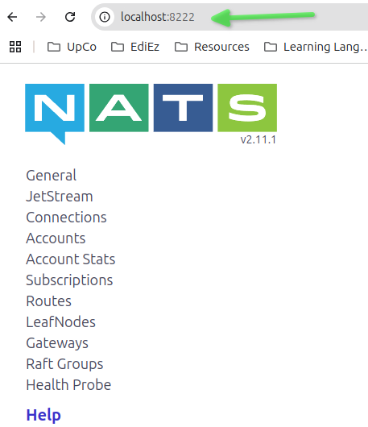

# NestJS + Microservicios: Aplicaciones escalables y modulares (parte 5)

- En este documento vamos a documentar el curso [NestJS + Microservicios: Aplicaciones escalables y modulares de Udemy](https://www.udemy.com/course/nestjs-microservicios)

## 05 Utilización de Nats como middleware de mensajería

### 05.01 Introducción

- Vamos a utilizar Nats como middleware de mensajería.
- Nats es un middleware de mensajería distribuida, de código abierto y compatible con AMQP 0.9.1, MQTT 3.1.1 y WebSockets.

### 05.02 Instalación de Nats

- Vamos a instalar Nats en nuestro sistema operativo usando Docker, como se indica en el siguiente enlace: [Docker Hub Nats](https://hub.docker.com/_/nats)
- Cada servidor expone varias puertos:
  - 4222 es para clientes.
  - 8222 es una puerta de administración HTTP para la información de informes.
  - 6222 es una puerta de enrutamiento para el clúster.
- Vamos a lanzar el servidor de Nats en un contenedor de Docker para probarlo.
- Lo incluiremos en el fichero `docker-compose.yml` del proyecto más adelante.
- Ejecutamos el siguiente comando para lanzar el servidor de Nats:

```bash
~/Training/microservices/nestjs-microservicios/02-Products-App$
docker run -d --name nats-main -p 4222:4222 -p 6222:6222 -p 8222:8222 nats
Unable to find image 'nats:latest' locally
latest: Pulling from library/nats
7a31ab99389a: Pull complete 
0bcd18a1de50: Pull complete 
Digest: sha256:031f9a7ed1e08524b3dff604bfaee5177baa95c25f039822b8d224a42373be4e
Status: Downloaded newer image for nats:latest
9af1c5a4365d5ac6d26024ae77a7a1bfe5ebed849f5f0c38aaa55a9c121ad5c3
```

- Podemos acceder a la interfaz de administración de Nats en el puerto 8222 desde el navegador.



### 05.03 Cambiar los microservicios para que utilicen Nats

- Vamos a cambiar los microservicios para que utilicen Nats como middleware de mensajería.
- Podemos acceder a la documentación de NestJS en el siguiente enlace: [NestJS Nats](https://docs.nestjs.com/microservices/nats)

#### 05.03.01 Instalación de los paquetes necesarios

- Tenemos que instalar el paquete `nats` en los microservicios que vamos a utilizar.

```bash
~/Training/microservices/nestjs-microservicios/02-Products-App/products-ms$
npm i nats

added 3 packages, and audited 832 packages in 2s

149 packages are looking for funding
  run `npm fund` for details

found 0 vulnerabilities
```

```bash
~/Training/microservices/nestjs-microservicios/02-Products-App/orders-ms$
npm i nats

added 3 packages, and audited 817 packages in 1s

147 packages are looking for funding
  run `npm fund` for details

found 0 vulnerabilities
```

```bash
~/Training/microservices/nestjs-microservicios/02-Products-App/client-gateway$ 
npm i nats

added 3 packages, and audited 817 packages in 1s

149 packages are looking for funding
  run `npm fund` for details
```

#### 05.03.02 Configuración de Nats en el proyecto de productos

##### 05.03.02.01 Creación de la variable de entorno del servidor de Nats

- Vamos a crear la variable de entorno del servidor de Nats en el fichero `.env` del microservicio de productos.

> 02-Products-App/products-ms/.env

```text
PORT=3001
NATS_SERVERS="nats://localhost:4222,nats://localhost:4223"
.
```

- Tenemos que modificar el fichero `envs.ts` para que se pueda leer la variable de entorno del servidor de Nats.

> 02-Products-App/products-ms/src/config/envs.ts

```ts
import 'dotenv/config';
import * as joi from 'joi';

interface EnvVars {
  PORT: number;
  DATABASE_URL: string;
  NATS_SERVERS: string[];
}

const envsSchema = joi
  .object({
    PORT: joi.number().required(),
    DATABASE_URL: joi.string().required(),
    NATS_SERVERS: joi.array().items(joi.string()).required(),
  })
  .unknown(true);

const { error, value } = envsSchema.validate({
  ...process.env,
  NATS_SERVERS: process.env.NATS_SERVERS?.split(','),
});

if (error) {
  throw new Error(`Config validation error: ${error.message}`);
}

const envVars: EnvVars = value;

export const envs = {
  port: envVars.PORT,
  databaseUrl: envVars.DATABASE_URL,
  natsServers: envVars.NATS_SERVERS,
};
```

##### 05.03.02.02 Modificar el documento `main.ts` para que utilice Nats como middleware de mensajería

- Vamos a modificar el documento `main.ts` para que utilice Nats como middleware de mensajería.

> 02-Products-App/products-ms/src/main.ts

```ts
.
async function bootstrap() {
.
  const app = await NestFactory.createMicroservice<MicroserviceOptions>(
    AppModule,
    {
      transport: Transport.NATS,
      options: {
        servers: envs.natsServers
      }
    }
  );
.
}
bootstrap();
```

#### 05.03.03 Configuración de Nats en el proyecto del Client Gateway

- Vamos a configurar el microservicio del client gateway para que utilice Nats como middleware de mensajería.

##### 05.03.03.01 Creación de la variable de entorno del servidor de Nats

- Vamos a crear la variable de entorno del servidor de Nats en el fichero `.env` del microservicio del client gateway.

> 02-Products-App/client-gateway/.env

```text
PORT=3000
NATS_SERVERS=nats://localhost:4222
```

- Tenemos que modificar el fichero `envs.ts` para que se pueda leer la variable de entorno del servidor de Nats.

> 02-Products-App/client-gateway/src/config/envs.ts

```ts
import 'dotenv/config';

import * as joi from 'joi';

interface EnvVars {
  PORT: number;
  NATS_SERVERS: string[];
}

const envsSchema = joi
  .object({
    PORT: joi.number().required(),
    NATS_SERVERS: joi.array().items(joi.string()).required(),
  })
  .unknown(true);

const { error, value } = envsSchema.validate({
  ...process.env,
  NATS_SERVERS: process.env.NATS_SERVERS?.split(','),
});

if (error) {
  throw new Error(`Config validation error: ${error.message}`);
}

const envVars: EnvVars = value;

export const envs = {
  port: envVars.PORT,
  natsServers: envVars.NATS_SERVERS,
};
```

##### 05.03.03.02 Modificar el `services.ts` para añadir el servicio de Nats

- Vamos a modificar el documento `services.ts` para añadir el servicio de Nats.

> 02-Products-App/client-gateway/src/config/services.ts

```ts
export const NATS_SERVICE = 'NATS_SERVICE';
```

##### 05.03.03.03 Modificar el `product/products.module.ts` para que utilice Nats como middleware de mensajería

- Vamos a modificar el documento `product/products.module.ts` para que utilice Nats como middleware de mensajería.

> 02-Products-App/client-gateway/src/products/products.module.ts

```ts
import { Module } from '@nestjs/common';
import { ProductsController } from './products.controller';
import { ClientsModule, Transport } from '@nestjs/microservices';
import { NATS_SERVICE, envs } from 'src/config';

@Module({
  controllers: [ProductsController],
  providers: [],
  imports: [
    ClientsModule.register([
      {
        name: NATS_SERVICE,
        transport: Transport.NATS,
        options: {
          servers: envs.natsServers,
        },
      },
    ]),
  ],
})
export class ProductsModule {}
```

##### 05.03.03.04 Modificar el `products/products.controller.ts` para que utilice Nats como middleware de mensajería

- Vamos a modificar el documento `products/products.controller.ts` para que utilice Nats como middleware de mensajería.

> 02-Products-App/client-gateway/src/products/products.controller.ts

```ts
import {
  Controller,
  Body,
  Logger,
  Get,
  Post,
  Query,
  Param,
  Delete,
  Patch,
  ParseIntPipe,
  Inject,
} from '@nestjs/common';
import { CreateProductDto } from './dto/create-product.dto';
import { PaginationDto } from 'src/common/dto/pagination.dto';
import { UpdateProductDto } from './dto/update-product.dto';
import { ClientProxy, RpcException } from '@nestjs/microservices';
import { NATS_SERVICE } from 'src/config';
import { catchError, firstValueFrom } from 'rxjs';

@Controller('products')
export class ProductsController {
  private readonly logger = new Logger(ProductsController.name);

  constructor(
    @Inject(NATS_SERVICE) private readonly client: ClientProxy,
  ) {}

  @Post()
  createProduct(@Body() createProductDto: CreateProductDto) {
    return this.client.send(
      { cmd: 'create-product' },
      createProductDto,
    );
  }

  @Get()
  findAllProducts(@Query() paginationDto: PaginationDto) {
    return this.client.send(
      { cmd: 'find-all-products' },
      paginationDto,
    );
  }

  @Get(':id')
  async findOne(@Param('id', ParseIntPipe) id: number) {
    try {
      return await firstValueFrom(
        this.client.send({ cmd: 'find-one-product' }, { id })
      );
    } catch (error) {
      throw new RpcException(error);
    }
  }

  @Delete(':id')
  async deleteProduct(@Param('id', ParseIntPipe) id: number) {
    try {
      return await firstValueFrom(
        this.client.send({ cmd: 'remove-product' }, { id })
      );
    } catch (error) {
      throw new RpcException(error);
    }
  }

  @Patch(':id')
  patchProduct(
    @Param('id', ParseIntPipe) id: number,
    @Body() updateProductDto: UpdateProductDto,
  ) {
    return this.client
      .send(
        { cmd: 'update-product' },
        {
          id,
          ...updateProductDto,
        },
      )
      .pipe(
        catchError((err) => {
          throw new RpcException(err);
        }),
      );
  }
}
```

##### 05.03.03.05 Modificar el `orders/orders.module.ts` para que utilice Nats como middleware de mensajería

- Vamos a modificar el documento `orders/orders.module.ts` para que utilice Nats como middleware de mensajería.

> 02-Products-App/client-gateway/src/orders/orders.module.ts

```ts
import { Module } from '@nestjs/common';
import { OrdersController } from './orders.controller';
import { envs, NATS_SERVICE } from 'src/config';
import { ClientsModule, Transport } from '@nestjs/microservices';

@Module({
  controllers: [OrdersController],
  providers: [],
  imports: [
    ClientsModule.register([
      {
        name: NATS_SERVICE,
        transport: Transport.NATS,
        options: {
          servers: envs.natsServers,
        },
      },
    ]),
  ],  
})
export class OrdersModule {}
```

##### 05.03.03.06 Modificar el `orders/orders.controller.ts` para que utilice Nats como middleware de mensajería

- Vamos a modificar el documento `orders/orders.controller.ts` para que utilice Nats como middleware de mensajería.

> 02-Products-App/client-gateway/src/orders/orders.controller.ts

```ts
import {
  Controller,
  Get,
  Post,
  Body,
  Patch,
  Param,
  Logger,
  Inject,
  Query,
  ParseUUIDPipe,
} from '@nestjs/common';
import { CreateOrderDto } from './dto/create-order.dto';
import { ClientProxy, RpcException } from '@nestjs/microservices';
import { NATS_SERVICE } from 'src/config';
import { firstValueFrom } from 'rxjs';
import { OrderPaginationDto } from './dto/order-pagination.dto';
import { StatusDto } from './dto/status.dto';
import { PaginationDto } from 'src/common/dto/pagination.dto';

@Controller('orders')
export class OrdersController {
  private readonly logger = new Logger(OrdersController.name);

  constructor(
    @Inject(NATS_SERVICE) private readonly client: ClientProxy,
  ) {}

  @Post()
  async create(@Body() createOrderDto: CreateOrderDto) {
    try {
      return await firstValueFrom(
        this.client.send('createOrder', createOrderDto)
      );
    } catch (error) {
      this.logger.error(`Error creating order: ${error.message}`);
      throw new RpcException(error);
    }
  }

  @Get()
  findAll(@Query() orderPaginationDto: OrderPaginationDto) {
    return this.client.send('findAllOrders', orderPaginationDto);
  }

  @Get(':status')
  async findAllByStatus(
    @Param() statusDto: StatusDto,
    @Query() paginationDto: PaginationDto,
  ) {
    try {
      return this.client.send('findAllOrders', {
        ...paginationDto,
        status: statusDto.status,
      });
    } catch (error) {
      throw new RpcException(error);
    }
  }

  @Get('id/:id')
  async findOne(@Param('id', ParseUUIDPipe) id: string) {
    try {
      const order = await firstValueFrom(
        this.client.send('findOneOrder', { id }),
      );
      return order;
    } catch (error) {
      throw new RpcException(error);
    }
  }

  @Patch(':id')
  changeStatus(
    @Param('id', ParseUUIDPipe) id: string,
    @Body() statusDto: StatusDto,
  ) {
    try {
      return this.client.send('changeOrderStatus', {
        id,
        status: statusDto.status,
      });
    } catch (error) {
      throw new RpcException(error);
    }
  }
}
```

#### 05.03.04 Configuración de Nats en el proyecto de pedidos

##### 05.03.04.01 Creación de la variable de entorno del servidor de Nats

- Vamos a crear la variable de entorno del servidor de Nats en el fichero `.env` del microservicio de pedidos.

> 02-Products-App/orders-ms/.env

```text
PORT=3002
NATS_SERVERS=nats://localhost:4222
.
```

##### 05.03.04.02 Modificar el `services.ts` para añadir el servicio de Nats

- Vamos a modificar el documento `services.ts` para añadir el servicio de Nats.

> 02-Products-App/orders-ms/src/config/services.ts  

```ts
export const NATS_SERVICE = 'NATS_SERVICE';
```

##### 05.03.04.03 Modificar el docmento `envs.ts` para que se pueda leer la variable de entorno del servidor de Nats

- Vamos a modificar el documento `envs.ts` para que se pueda leer la variable de entorno del servidor de Nats.

> 02-Products-App/orders-ms/src/config/envs.ts

```ts
import 'dotenv/config';

import * as joi from 'joi';

interface EnvVars {
  PORT: number;
  NATS_SERVERS: string[];
}

const envsSchema = joi
  .object({
    PORT: joi.number().required(),
    NATS_SERVERS: joi.array().items(joi.string()).required(),
  })
  .unknown(true);

const { error, value } = envsSchema.validate({
  ...process.env,
  NATS_SERVERS: process.env.NATS_SERVERS?.split(','),
});

if (error) {
  throw new Error(`Config validation error: ${error.message}`);
}

const envVars: EnvVars = value;

export const envs = {
  port: envVars.PORT,
  natsServers: envVars.NATS_SERVERS,
};
```

##### 05.03.04.04 Modificar el `orders/orders.module.ts` para que utilice Nats como middleware de mensajería

- Vamos a modificar el documento `orders/orders.module.ts` para que utilice Nats como middleware de mensajería.

> 02-Products-App/orders-ms/src/orders/orders.module.ts

```ts
import { Module } from '@nestjs/common';
import { OrdersService } from './orders.service';
import { OrdersController } from './orders.controller';
import { ClientsModule, Transport } from '@nestjs/microservices';
import { NATS_SERVICE } from 'src/config/services';
import { envs } from 'src/config';

@Module({
  controllers: [OrdersController],
  providers: [OrdersService],
  imports: [
    ClientsModule.register([
      {
        name: NATS_SERVICE,
        transport: Transport.NATS,
        options: {
          servers: envs.natsServers,
        },
      },
    ]),
  ],
})
export class OrdersModule {}
```

##### 05.03.04.05 Modificar el `orders/orders.service.ts` para que utilice Nats como middleware de mensajería

- Vamos a modificar el documento `orders/orders.service.ts` para que utilice Nats como middleware de mensajería.

> 02-Products-App/orders-ms/src/orders/orders.service.ts

```ts
import { HttpStatus, Inject, Injectable, Logger, OnModuleInit } from '@nestjs/common';
import { CreateOrderDto } from './dto/create-order.dto';
import { PrismaClient } from '@prisma/client';
import { OrderPaginationDto } from './dto/order-pagination.dto';
import { ClientProxy, RpcException } from '@nestjs/microservices';
import { ChangeOrderStatusDto } from './dto/change-order-status.dto';
import { firstValueFrom } from 'rxjs';
import { NATS_SERVICE } from 'src/config/services';

const debug = false;

@Injectable()
export class OrdersService extends PrismaClient implements OnModuleInit {
  private readonly logger = new Logger(OrdersService.name);

  
  constructor(
    @Inject(NATS_SERVICE) private readonly client: ClientProxy,
  ) {
    super();
  }

  async onModuleInit() {
    await this.$connect();
    this.logger.log('Connected to database');
  }

  async create(createOrderDto: CreateOrderDto) {
    try {
      //1 Confirmar los ids de los productos
      const productIds = createOrderDto.items.map((item) => item.productId);
      if (debug) {
        this.logger.debug(`Validating products ${productIds}`);
      }
      const products = await firstValueFrom(
        this.client.send({ cmd: 'validate-products' }, { ids: productIds }),
      );
      if (debug) {
        this.logger.debug(`Products validated: ${JSON.stringify(products, null, 2)}`);
      }

      if (!products || products.length === 0) {
        throw new RpcException({
          status: HttpStatus.BAD_REQUEST,
          message: 'Products not found',
        });
      }

      //2. Cálculos de los valores
      const totalAmount = createOrderDto.items.reduce((acc, orderItem) => {
        const price = products.find(
          (product: { id: number; }) => product.id === orderItem.productId,
        ).price;
        const total = price * orderItem.quantity;
        if (debug) {
          this.logger.debug(`Product ${orderItem.productId} price: ${price} total: ${total}`);
        }
        return acc + total;
      }, 0);
      if (debug) {
        this.logger.debug(`Total amount: ${totalAmount}`);
      }

      const totalItems = createOrderDto.items.reduce((acc, orderItem) => {
        return acc + orderItem.quantity;
      }, 0);
      if (debug) {
        this.logger.debug(`Total items: ${totalItems}`);
      }

      //3. Crear una transacción de base de datos
      const order = await this.order.create({
        data: {
          totalAmount: totalAmount,
          totalItems: totalItems,
          OrderItem: {
            createMany: {
              data: createOrderDto.items.map((orderItem) => ({
                price: products.find(
                  (product: { id: number; }) => product.id === orderItem.productId,
                ).price,
                productId: orderItem.productId,
                quantity: orderItem.quantity,
              })),
            },
          },
        },
        include: {
          OrderItem: {
            select: {
              price: true,
              quantity: true,
              productId: true,
            },
          },
        },
      });
      if (debug) {
        this.logger.debug(`Order created: ${JSON.stringify(order, null, 2)}`);
      }

      return {
        ...order,
        OrderItem: order.OrderItem.map((orderItem) => ({
          ...orderItem,
          name: products.find((product: { id: number; }) => product.id === orderItem.productId)
            .name,
        })),
      };
    } catch (error) {
      if (debug) {
        this.logger.debug(`Error creating order: ${error.message}`);
      }
      throw new RpcException({
        status: HttpStatus.BAD_REQUEST,
        message: 'Check logs',
      });
    }
  }

  async findAll(orderPaginationDto: OrderPaginationDto) {
    const { page, limit, status } = orderPaginationDto;

    const totalPages = await this.order.count({
      where: { status },
    });
    const lastPage = Math.ceil(totalPages / limit);

    return {
      data: await this.order.findMany({
        skip: (page - 1) * limit,
        take: limit,
        where: { status },
      }),
      meta: {
        total: totalPages,
        page,
        lastPage,
      },
    };
  }

  async findOne(id: string) {
    const order = await this.order.findFirst({
      where: { id },
      include: {
        OrderItem: {
          select: {
            price: true,
            quantity: true,
            productId: true,
          },
        },
      },
    });

    if (!order) {
      throw new RpcException({
        status: HttpStatus.NOT_FOUND,
        message: `Order with id ${id} not found`,
      });
    }
    const productIds = order.OrderItem.map((item) => item.productId);
    const products = await firstValueFrom(
      this.client.send({ cmd: 'validate-products' }, { ids: productIds }),
    );    

    return {
      ...order,
      OrderItem: order.OrderItem.map((orderItem) => ({
        ...orderItem,
        name: products.find((product: { id: number; }) => product.id === orderItem.productId)
          .name,
      })),
    };
  }

  async changeStatus(changeOrderStatusDto: ChangeOrderStatusDto) {
    const { id, status } = changeOrderStatusDto;

    const order = await this.findOne(id);
    if (order.status === status) {
      return order;
    }

    return this.order.update({
      where: { id },
      data: { status },
    });
  }
}
```

### 05.04 Creación de un módulo personalizado para el manejo de Nats en el proyecto de Client Gateway

- Vamos a crear un módulo personalizado para el manejo de Nats en el proyecto de Client Gateway.

> 02-Products-App/client-gateway/src/transports/nats.module.ts

```ts
import { Module } from '@nestjs/common';
import { ClientsModule, Transport } from '@nestjs/microservices';
import { NATS_SERVICE, envs } from 'src/config';

@Module({
  imports: [
    ClientsModule.register([
      {
        name: NATS_SERVICE,
        transport: Transport.NATS,
        options: {
          servers: envs.natsServers,
        },
      },
    ]),
  ],
  exports: [
    ClientsModule.register([
      {
        name: NATS_SERVICE,
        transport: Transport.NATS,
        options: {
          servers: envs.natsServers,
        },
      },
    ]),
  ],
})
export class NatsModule {}
```

- Tenemos que cambiar el fichero `AppModule` para que utilice el módulo personalizado de Nats.

> 02-Products-App/client-gateway/src/app.module.ts

```ts
import { Module } from '@nestjs/common';
import { ProductsModule } from './products/products.module';
import { OrdersModule } from './orders/orders.module';
import { NatsModule } from './transports/nats.module';

@Module({
  imports: [ProductsModule, OrdersModule, NatsModule],
  controllers: [],
  providers: [],
})
export class AppModule {}
```

- Vamos a modificar el fichero `orders/orders.module.ts` para que utilice el módulo personalizado de Nats.

> 02-Products-App/orders-ms/src/orders/orders.module.ts

```ts
import { Module } from '@nestjs/common';
import { OrdersController } from './orders.controller';
import { NatsModule } from 'src/transports/nats.module';

@Module({
  controllers: [OrdersController],
  imports: [NatsModule],
})
export class OrdersModule {}
```

- Vamos a modificar el fichero `products/products.module.ts` para que utilice el módulo personalizado de Nats.

> 02-Products-App/client-gateway/src/products/products.module.ts

```ts
import { Module } from '@nestjs/common';
import { ProductsController } from './products.controller';
import { NatsModule } from 'src/transports/nats.module';

@Module({
  controllers: [ProductsController],
  providers: [],
  imports: [NatsModule],
})
export class ProductsModule {}
```

### 05.05 Utilización del módulo personalizado para el manejo de Nats en el proyecto de Pedidos (Orders)

- Vamos a utilizar el módulo personalizado para el manejo de Nats en el proyecto de Pedidos.
- Tenemos que copiar el módulo personalizado de Nats en el proyecto de Pedidos.

> 02-Products-App/orders-ms/src/transports/nats.module.ts

```ts
import { Module } from '@nestjs/common';
import { ClientsModule, Transport } from '@nestjs/microservices';
import { NATS_SERVICE, envs } from 'src/config';

@Module({
  imports: [
    ClientsModule.register([
      {
        name: NATS_SERVICE,
        transport: Transport.NATS,
        options: {
          servers: envs.natsServers,
        },
      },
    ]),
  ],
  exports: [
    ClientsModule.register([
      {
        name: NATS_SERVICE,
        transport: Transport.NATS,
        options: {
          servers: envs.natsServers,
        },
      },
    ]),
  ],
})
export class NatsModule {}
```

- Vamos a modificar el fichero `app.module.ts` para que utilice el módulo personalizado de Nats.

> 02-Products-App/orders-ms/src/app.module.ts

```ts
import { Module } from '@nestjs/common';
import { OrdersModule } from './orders/orders.module';
import { NatsModule } from './transports/nats.module';

@Module({
  imports: [OrdersModule, NatsModule],
  controllers: [],
  providers: [],
})
export class AppModule {}
```

- Vamos a modificar el fichero `orders/orders.module.ts` para que utilice el módulo personalizado de Nats.

> 02-Products-App/orders-ms/src/orders/orders.module.ts

```ts
import { Module } from '@nestjs/common';
import { OrdersService } from './orders.service';
import { OrdersController } from './orders.controller';
import { NatsModule } from 'src/transports/nats.module';

@Module({
  controllers: [OrdersController],
  providers: [OrdersService],
  imports: [NatsModule],
})
export class OrdersModule {}
```

- Tenemos que modificar el fichero `main.ts` para que utilice el módulo personalizado de Nats para poder obtener información de los productos.

> 02-Products-App/orders-ms/src/main.ts

```ts
import { NestFactory } from '@nestjs/core';
import { Logger, ValidationPipe } from '@nestjs/common';
import { AppModule } from './app.module';
import { envs } from './config';
import { MicroserviceOptions, Transport } from '@nestjs/microservices';
async function bootstrap() {
  const logger = new Logger('OrdersMS-Main');

  const app = await NestFactory.createMicroservice<MicroserviceOptions>(
    AppModule,
    {
      transport: Transport.NATS,
      options: {
        servers: envs.natsServers
      },
    },
  );

  app.useGlobalPipes(
    new ValidationPipe({
      whitelist: true,
      forbidNonWhitelisted: true,
    }),
  );

  await app.listen();
  logger.log(`OrdersMS Microservice running on port ${envs.port}`);
}
bootstrap();
```
