# NestJS + Microservicios: Aplicaciones escalables y modulares (parte 7)

- En este documento vamos a documentar el curso [NestJS + Microservicios: Aplicaciones escalables y modulares de Udemy](https://www.udemy.com/course/nestjs-microservicios)

## 07 Pagos con Stripe (Payments Microservice)

### 07.01 Introducción

- Vamos a crear un microservicio para gestionar los pagos con Stripe.
- Para ello vamos a utilizar el SDK de Stripe.
- En esta parte vamos a crear el microservicio independiente del resto de microservicios para poder probarlo de forma independiente.
- Una vez probado, lo integraremos en el sistema especialmente ligado con el microservicio de pedidos.

### 07.02 Creación del microservicio payments-ms

```bash
~/Training/microservices/nestjs-microservicios/02-Products-App$ 
nest new payments-ms --skip-git
✨  We will scaffold your app in a few seconds..

✔ Which package manager would you ❤️ to use? npm
CREATE payments-ms/.prettierrc (51 bytes)
CREATE payments-ms/README.md (5020 bytes)
CREATE payments-ms/eslint.config.mjs (856 bytes)
CREATE payments-ms/nest-cli.json (171 bytes)
CREATE payments-ms/package.json (2037 bytes)
CREATE payments-ms/tsconfig.build.json (97 bytes)
CREATE payments-ms/tsconfig.json (544 bytes)
CREATE payments-ms/src/app.controller.ts (274 bytes)
CREATE payments-ms/src/app.module.ts (249 bytes)
CREATE payments-ms/src/app.service.ts (142 bytes)
CREATE payments-ms/src/main.ts (228 bytes)
CREATE payments-ms/src/app.controller.spec.ts (617 bytes)
CREATE payments-ms/test/jest-e2e.json (183 bytes)
CREATE payments-ms/test/app.e2e-spec.ts (674 bytes)

✔ Installation in progress... ☕

🚀  Successfully created project payments-ms
👉  Get started with the following commands:

$ cd payments-ms
$ npm run start

                                         
                          Thanks for installing Nest 🙏
                 Please consider donating to our open collective
                        to help us maintain this package.
                                         
                                         
               🍷  Donate: https://opencollective.com/nest
```

- Como hemos usado el flag `--skip-git` no se crea el .gitignore, por lo que lo creamos nosotros.
- Lo podemos copiar del directorio 02-Products-App/products-ms/.gitignore

```bash
cp products-ms/.gitignore payments-ms/.gitignore
```

- Vamos a probar el proyecto para ver que todo está bien.

```bash
cd payments-ms
~/Training/microservices/nestjs-microservicios/02-Products-App/payments-ms$ 
npm run start

> payments-ms@0.0.1 start
> nest start

[Nest] 143588  - 11/04/2025, 09:05:07     LOG [NestFactory] Starting Nest application...
[Nest] 143588  - 11/04/2025, 09:05:07     LOG [InstanceLoader] AppModule dependencies initialized +7ms
[Nest] 143588  - 11/04/2025, 09:05:07     LOG [RoutesResolver] AppController {/}: +3ms
[Nest] 143588  - 11/04/2025, 09:05:07     LOG [RouterExplorer] Mapped {/, GET} route +2ms
[Nest] 143588  - 11/04/2025, 09:05:07     LOG [NestApplication] Nest application successfully started +1ms
npm run start
```

### 07.03 Instalación de los paquetes npm necesarios

- Vamos a instalar el paquete de Stripe en el microservicio de pagos.
- Instalaremos el paquete `dotenv` para la lectura del archivo `.env`.
- Vamos a utilizar el paquete `joi` para validar el archivo `.env`.
- Vamos a instalar los paquetes de `class-transformer` y `class-validator` para que funcione correctamente las validaciones de los datos de los DTOs.
- Vamos a instalar el paquete `@nestjs/microservices` para que funcione correctamente el microservicio.

```bash
~/Training/microservices/nestjs-microservicios/02-Products-App/payments-ms$
npm i stripe dotenv joi class-transformer class-validator @nestjs/microservices

added 16 packages, and audited 813 packages in 5s

148 packages are looking for funding
  run `npm fund` for details

found 0 vulnerabilities
```

### 07.04 Creación de un servicio de configuración

#### 07.04.01 Creación del archivo .env

- Vamos a crear el archivo `.env` en el directorio `02-Products-App/payments-ms` que será el encargado de almacenar las variables de entorno.

> 02-Products-App/payments-ms/.env.template

```text
PORT=3003

# https://dashboard.stripe.com/test/apikeys
STRIPE_SECRET=
STRIPE_SUCCESS_URL=http://localhost:3003/payments/success
STRIPE_CANCEL_URL=http://localhost:3003/payments/cancel

# https://dashboard.stripe.com/test/webhooks/we_1OrjjpLpSSVtW50ltIQEAP8z
# Este es el signing secret del webhook
STRIPE_ENDPOINT_SECRET=
```

#### 07.04.02 Creación del documento envs.ts

- Vamos a crear el documento `envs.ts` en el directorio `02-Products-App/payments-ms/src/config` que será el encargado de leer y validar el archivo `.env`.

```bash
import 'dotenv/config';

import * as joi from 'joi';

interface EnvVars {
  PORT: number;

  STRIPE_SECRET: string;
  STRIPE_SUCCESS_URL: string;
  STRIPE_CANCEL_URL: string;
  STRIPE_ENDPOINT_SECRET: string;
}

const envsSchema = joi.object({
  PORT: joi.number().required(),

  STRIPE_SECRET: joi.string().required(),
  STRIPE_SUCCESS_URL: joi.string().required(),
  STRIPE_CANCEL_URL: joi.string().required(),
  STRIPE_ENDPOINT_SECRET: joi.string().required(),
})
.unknown(true);

const { error, value } = envsSchema.validate( process.env );


if ( error ) {
  throw new Error(`Config validation error: ${ error.message }`);
}

const envVars:EnvVars = value;


export const envs = {
  port: envVars.PORT,
  stripeSecret: envVars.STRIPE_SECRET,
  stripeSuccessUrl: envVars.STRIPE_SUCCESS_URL,
  stripeCancelUrl: envVars.STRIPE_CANCEL_URL,
  stripeEndpointSecret: envVars.STRIPE_ENDPOINT_SECRET,
}
```

#### 07.04.03 Modificación del documento main.ts

- Vamos a modificar el documento `main.ts` en el directorio `02-Products-App/payments-ms/src` para que utilice el servicio de configuración.

```bash
import { NestFactory } from '@nestjs/core';
import { AppModule } from './app.module';
import { Logger, ValidationPipe } from '@nestjs/common';
import { envs } from './config/envs';

async function bootstrap() {
  const logger = new Logger('Payments-ms');
  
  const app = await NestFactory.create(AppModule);

  app.useGlobalPipes(
    new ValidationPipe({
      whitelist: true,
      forbidNonWhitelisted: true,
    }),
  );

  await app.listen(envs.port);

  logger.log(`Payments Microservice running on port ${envs.port}`);
}
bootstrap();
```

- Vamos a asegurarnos de que el microservicio de payments-ms funciona y está escuchando en el puerto 3003.

```bash
~/Training/microservices/nestjs-microservicios/02-Products-App/payments-ms$ 
npm run start

> payments-ms@0.0.1 start
> nest start

[Nest] 181671  - 11/04/2025, 09:54:17     LOG [NestFactory] Starting Nest application...
[Nest] 181671  - 11/04/2025, 09:54:17     LOG [InstanceLoader] AppModule dependencies initialized +6ms
[Nest] 181671  - 11/04/2025, 09:54:17     LOG [NestApplication] Nest application successfully started +146ms
[Nest] 181671  - 11/04/2025, 09:54:17     LOG [Payments-ms] Payments Microservice running on port 3003
```

### 07.05 Creación del recurso payments

#### 07.05.01 Creación del recurso payments

- Vamos a crear el recurso `payments` en el directorio `02-Products-App/payments-ms/src/payments` que será el encargado de gestionar los pagos con Stripe.

```bash
~/Training/microservices/nestjs-microservicios/02-Products-App/payments-ms$ 
nest g resource payments --no-spec
✔ What transport layer do you use? REST API
✔ Would you like to generate CRUD entry points? No
CREATE src/payments/payments.controller.ts (228 bytes)
CREATE src/payments/payments.module.ts (269 bytes)
CREATE src/payments/payments.service.ts (92 bytes)
UPDATE package.json (2253 bytes)
UPDATE src/app.module.ts (207 bytes)
✔ Packages installed successfully.
```

#### 07.05.02 Creación de los DTOs que se utilizarán en el recurso payments

- Vamos a crear el documento `payment-session.dto.ts` en el directorio `02-Products-App/payments-ms/src/payments/dto` que será el encargado de gestionar los datos de la sesión de pago.

> 02-Products-App/payments-ms/src/payments/dto/payment-session.dto.ts

```typescript
import { Type } from 'class-transformer';
import {
  ArrayMinSize,
  IsArray,
  IsNumber,
  IsPositive,
  IsString,
  ValidateNested,
} from 'class-validator';

export class PaymentSessionDto {
  @IsString()
  orderId: string;

  @IsString()
  currency: string;

  @IsArray()
  @ArrayMinSize(1)
  @ValidateNested({ each: true })
  @Type(() => PaymentSessionItemDto)
  items: PaymentSessionItemDto[];
}

export class PaymentSessionItemDto {
  @IsString()
  name: string;

  @IsNumber()
  @IsPositive()
  price: number;

  @IsNumber()
  @IsPositive()
  quantity: number;
}
```

#### 07.05.02 Modificación del documento payments.controller.ts

- Vamos a modificar el documento `payments.controller.ts` en el directorio `02-Products-App/payments-ms/src/payments` para definir los endpoints de los pagos.
- `create-payment-session`: Endpoint para crear una sesión de pago.
- `success`: Endpoint que utiliza Stripe para confirmar el pago y redirigir al usuario a la página de éxito.
- `cancel`: Endpoint que utiliza Stripe para cancelar el pago y redirigir al usuario a la página de cancelación.
- `webhook`: Endpoint para recibir las notificaciones del webhook de Stripe.

> 02-Products-App/payments-ms/src/payments/payments.controller.ts

```typescript
import { Controller, Get, Post, Req, Res, Body, Logger } from '@nestjs/common';
import { PaymentsService } from './payments.service';
import { PaymentSessionDto } from './dto/payment-session.dto';
import { Request, Response } from 'express'

@Controller('payments')
export class PaymentsController {

  private readonly logger = new Logger(PaymentsController.name);

  constructor(private readonly paymentsService: PaymentsService) {}

  @Post('create-payment-session')
  createPaymentSession(@Body() paymentSessionDto: PaymentSessionDto ) {
    return {
      ok: true,
      message: 'Payment session created',
      paymentSessionDto
    }    
    // return this.paymentsService.createPaymentSession(paymentSessionDto);
  }

  @Get('success')
  success() {
    return {
      ok: true,
      message: 'Payment successful'
    }
  }

  @Get('cancel')
  cancel() {
    return {
      ok: false,
      message: 'Payment cancelled'
    }
  }


  @Post('webhook')
  async stripeWebhook(@Req() req: Request, @Res() res: Response) {
    this.logger.log(JSON.stringify(req.body, null, 2));
    return res.status(200).json({ ok: true, message: 'Webhook received' });
    // return this.paymentsService.stripeWebhook(req, res);
  }  
}
```

#### 07.05.03 Creación del documento payments.http para probar el microservicio

- Vamos a crear el documento `payments.http` en el directorio `02-Products-App/payments-ms` para probar el microservicio.

> 02-Products-App/payments-ms/payments.http

```http
@url = http://localhost:3003/payments

### Crear una sesión de pago
POST {{url}}/create-payment-session
Content-Type: application/json

{
  "orderId": "1234567890",
  "currency": "USD",
  "items": [
    {
      "name": "Producto 1",
      "price": 100,
      "quantity": 1
    },
    {
      "name": "Producto 2",
      "price": 200,
      "quantity": 2
    }
  ]
}

### Obtener confirmación de pago
GET {{url}}/success

### Obtener cancelación de pago
GET {{url}}/cancel

### Obtener webhook de Stripe
POST {{url}}/webhook
Content-Type: application/json

{
  "event": "payment_intent.succeeded"
}
```

- Debemos asegurarnos de que todos los endpoints están funcionando correctamente.

### 07.06 Registro en Stripe

#### 07.06.01 Creación de un nuevo usuario en Stripe

- Para poder utilizar Stripe, primero debemos crear un usuario en Stripe.
- Para ello vamos a utilizar el dashboard de Stripe.
- Siempre hay que seleccionar el entorno de desarrollo (o test environment).
- Debemos acceder a la sección de `developers`.

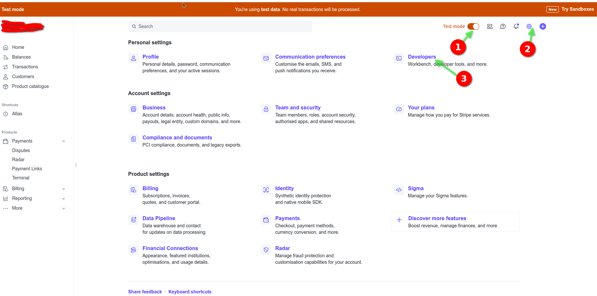

- Tenemos que marcar `[X] Enable Workbench` para las opciones de desarrollo.
- Después hay que expandir el `Workbench`.

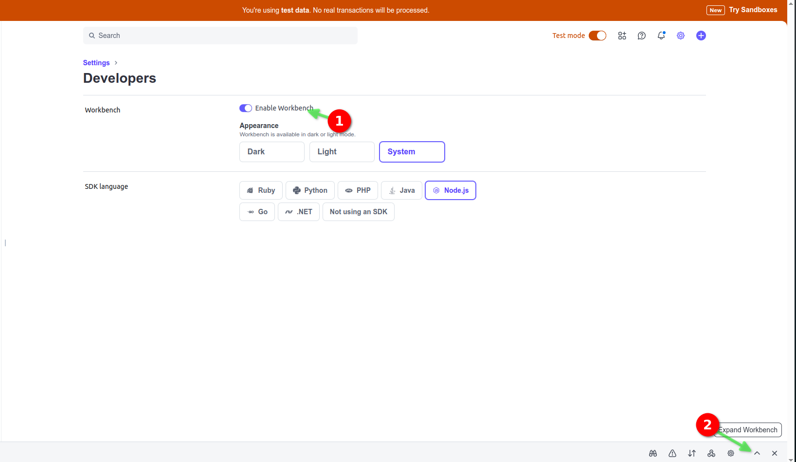 

- En la parte de API keys, vamos a crear una nueva clave secreta o utilizar la que ya tenemos.

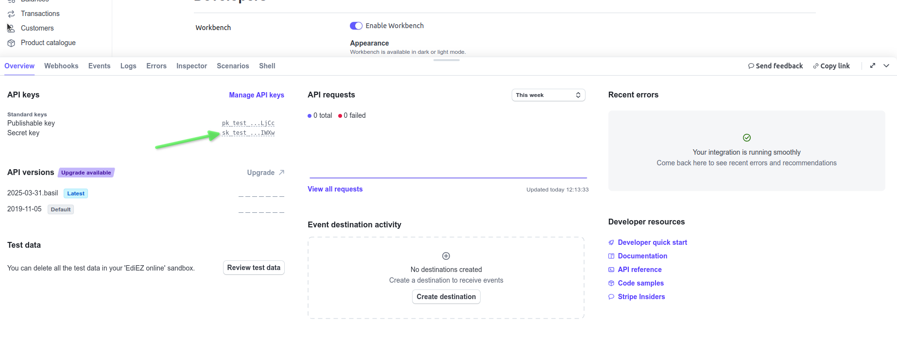

- Tenemos que copiar la `Secret Key` (clave secreta) y la pegamos en el archivo `.env` en la variable `STRIPE_SECRET`.

- Copiamos la clave secreta y la pegamos en el archivo `.env` en la variable `STRIPE_SECRET`.

- También debemos obtener el `signing secret` del webhook de Stripe.

#### 07.06.02 Instalación de Stripe CLI

- Vamos a instalar el CLI de Stripe.
- Tenemos que acceder a la página de <https://github.com/stripe/stripe-cli/releases> para saber la última versión.

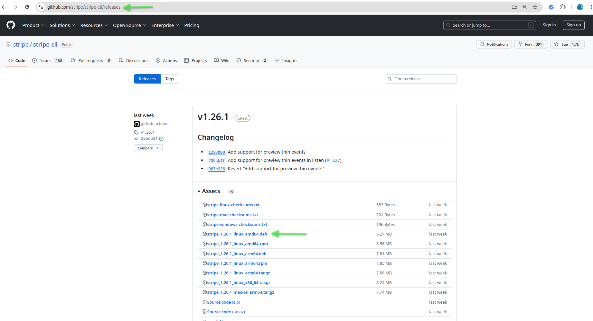

- Vamos a descargar el archivo `stripe_linux_amd64` y lo ejecutamos.

```bash
~/Downloads
curl -L -o stripe.deb \
  https://github.com/stripe/stripe-cli/releases/download/v1.26.1/stripe_1.26.1_linux_amd64.deb
  % Total    % Received % Xferd  Average Speed   Time    Time     Time  Current
                                 Dload  Upload   Total   Spent    Left  Speed
  0     0    0     0    0     0      0      0 --:--:-- --:--:-- --:--:--     0
100 8471k  100 8471k    0     0  5739k      0  0:00:01  0:00:01 --:--:-- 14.0M
```

- Vamos a instalar el CLI de Stripe.

```bash
~/Downloads
sudo dpkg -i stripe.deb
[sudo] password for juanpabloperez: 
Selecting previously unselected package stripe.
(Reading database ... 543089 files and directories currently installed.)
Preparing to unpack stripe.deb ...
Unpacking stripe (1.26.1) ...
Setting up stripe (1.26.1) ...
```

- Tenemos que asegurarnos de que podemos acceder a la CLI de Stripe.

```bash
~/Training/microservices/nestjs-microservicios$
stripe version
stripe version 1.26.1
```

- Tenemos que iniciar sesión en Stripe ejecutando el siguiente comando.

```bash
stripe login
Your pairing code is: hug-trusty-loyal-freed
This pairing code verifies your authentication with Stripe.
Press Enter to open the browser or visit https://dashboard.stripe.com/stripecli/confirm_auth?t=ZorY7x3R52Os9hjdtQtaVDrHvTUhAhDM (^C to quit)
```

- Vamos a abrir el navegador y acceder al link que nos proporciona el CLI de Stripe.

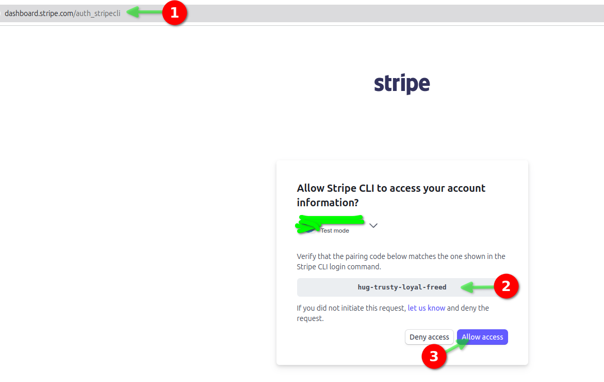

- Una vez que comprobamos que el código es correcto hay que clicar en `Allow Access`.

- Debemos ver el mensaje de éxito.

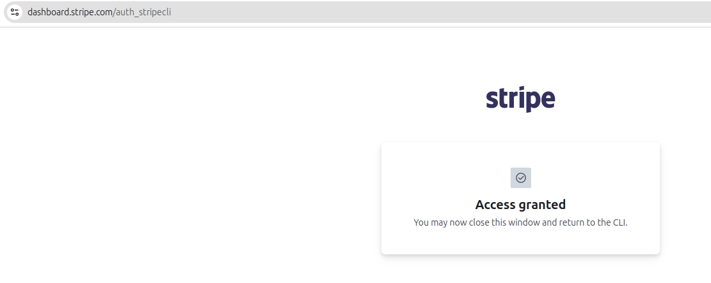

### 07.07 Modificar el archivo de `payments.service.ts` para incluir las llamadas a la API de Stripe

- Vamos a modificar el archivo `payments.service.ts` en el directorio `02-Products-App/payments-ms/src/payments` para incluir las llamadas a la API de Stripe.

> 02-Products-App/payments-ms/src/payments/payments.service.ts

```typescript
import { Injectable } from '@nestjs/common';
import { PaymentSessionDto } from './dto/payment-session.dto';
import { envs } from 'src/config/envs';
import Stripe from 'stripe';

@Injectable()
export class PaymentsService {
    private readonly stripe = new Stripe(envs.stripeSecret);

    async createPaymentSession(paymentSessionDto: PaymentSessionDto) {
      const { currency, items, orderId } = paymentSessionDto;
  
      const lineItems = items.map((item) => {
        return {
          price_data: {
            currency: currency,
            product_data: {
              name: item.name,
            },
            unit_amount: Math.round(item.price * 100), // 20 dólares 2000 / 100 = 20.00 // 15.0000
          },
          quantity: item.quantity,
        };
      });
  
      const session = await this.stripe.checkout.sessions.create({
        // Colocar aquí el ID de mi orden
        payment_intent_data: {
          metadata: {
            orderId: orderId
          },
        },
        line_items: lineItems,
        mode: 'payment',
        success_url: envs.stripeSuccessUrl,
        cancel_url: envs.stripeCancelUrl,
      });
  
      return session;
    }

}
```

### 07.08 Modificación del documento payments.controller.ts para utilizar el servicio de payments

- Vamos a modificar el documento `payments.controller.ts` en el directorio `02-Products-App/payments-ms/src/payments` para utilizar el servicio de payments.

> 02-Products-App/payments-ms/src/payments/payments.controller.ts

```typescript
import { Controller, Get, Post, Req, Res, Body, Logger } from '@nestjs/common';
import { PaymentsService } from './payments.service';
import { PaymentSessionDto } from './dto/payment-session.dto';
import { Request, Response } from 'express'

@Controller('payments')
export class PaymentsController {
  @Post('create-payment-session')
  createPaymentSession(@Body() paymentSessionDto: PaymentSessionDto ) {
    return this.paymentsService.createPaymentSession(paymentSessionDto);
  }
.
}
```

### 07.09 Probar la creación de una sesión de pago

- Vamos a probar la creación de una sesión de pago utilizando el archivo `payments.http`.

```bash
@url = http://localhost:3003/payments

### Crear una sesión de pago
POST {{url}}/create-payment-session
Content-Type: application/json

{
  "orderId": "1234567890",
  "currency": "USD",
  "items": [
    {
      "name": "Producto 1",
      "price": 100,
      "quantity": 1
    },
    {
      "name": "Producto 2",
      "price": 200,
      "quantity": 2
    }
  ]
}
```

- Se recibe la respuesta de la sesión de pago.

```json
HTTP/1.1 201 Created
X-Powered-By: Express
Content-Type: application/json; charset=utf-8
Content-Length: 2134
ETag: W/"856-0PsVHko2VEN4MGv5cPL1TihGBPk"
Date: Fri, 11 Apr 2025 13:13:28 GMT
Connection: close

{
  "id": "cs_test_b1PIBCFDL8uEMoUW4PtTKILZsdWwOCe5vj6noU1aPDUuOcEcHcvxozMpKJ",
  "object": "checkout.session",
  "adaptive_pricing": {
    "enabled": true
  },
  "after_expiration": null,
  "allow_promotion_codes": null,
  "amount_subtotal": 50000,
  "amount_total": 50000,
  "automatic_tax": {
    "enabled": false,
    "liability": null,
    "status": null
  },
  "billing_address_collection": null,
  "cancel_url": "http://localhost:3003/payments/cancel",
  "client_reference_id": null,
  "client_secret": null,
  "collected_information": null,
  "consent": null,
  "consent_collection": null,
  "created": 1744377208,
  "currency": "usd",
  "currency_conversion": null,
  "custom_fields": [],
  "custom_text": {
    "after_submit": null,
    "shipping_address": null,
    "submit": null,
    "terms_of_service_acceptance": null
  },
  "customer": null,
  "customer_creation": "if_required",
  "customer_details": null,
  "customer_email": null,
  "discounts": [],
  "expires_at": 1744463608,
  "invoice": null,
  "invoice_creation": {
    "enabled": false,
    "invoice_data": {
      "account_tax_ids": null,
      "custom_fields": null,
      "description": null,
      "footer": null,
      "issuer": null,
      "metadata": {},
      "rendering_options": null
    }
  },
  "livemode": false,
  "locale": null,
  "metadata": {},
  "mode": "payment",
  "payment_intent": null,
  "payment_link": null,
  "payment_method_collection": "if_required",
  "payment_method_configuration_details": {
    "id": "pmc_1PtBAMAuKa0CJ0CUOU3SIQmD",
    "parent": null
  },
  "payment_method_options": {
    "card": {
      "request_three_d_secure": "automatic"
    }
  },
  "payment_method_types": [
    "card",
    "link"
  ],
  "payment_status": "unpaid",
  "permissions": null,
  "phone_number_collection": {
    "enabled": false
  },
  "recovered_from": null,
  "saved_payment_method_options": null,
  "setup_intent": null,
  "shipping_address_collection": null,
  "shipping_cost": null,
  "shipping_options": [],
  "status": "open",
  "submit_type": null,
  "subscription": null,
  "success_url": "http://localhost:3003/payments/success",
  "total_details": {
    "amount_discount": 0,
    "amount_shipping": 0,
    "amount_tax": 0
  },
  "ui_mode": "hosted",
  "url": "https://checkout.stripe.com/c/pay/cs_test_b1PIBCFDL8uEMoUW4PtTKILZsdWwOCe5vj6noU1aPDUuOcEcHcvxozMpKJ#fidkdWxOYHwnPyd1blpxYHZxWkRPTlx2VkdOVGh%2FZ3NdSjNmMkFMVFdgZDU1SFBuMElvRmYnKSdjd2poVmB3c2B3Jz9xd3BgKSdpZHxqcHFRfHVgJz8naHBpcWxabHFgaCcpJ2BrZGdpYFVpZGZgbWppYWB3dic%2FcXdwYHgl",
  "wallet_options": null
}
```

- Vamos a copiar el `url` de la respuesta y lo pegamos en el navegador.

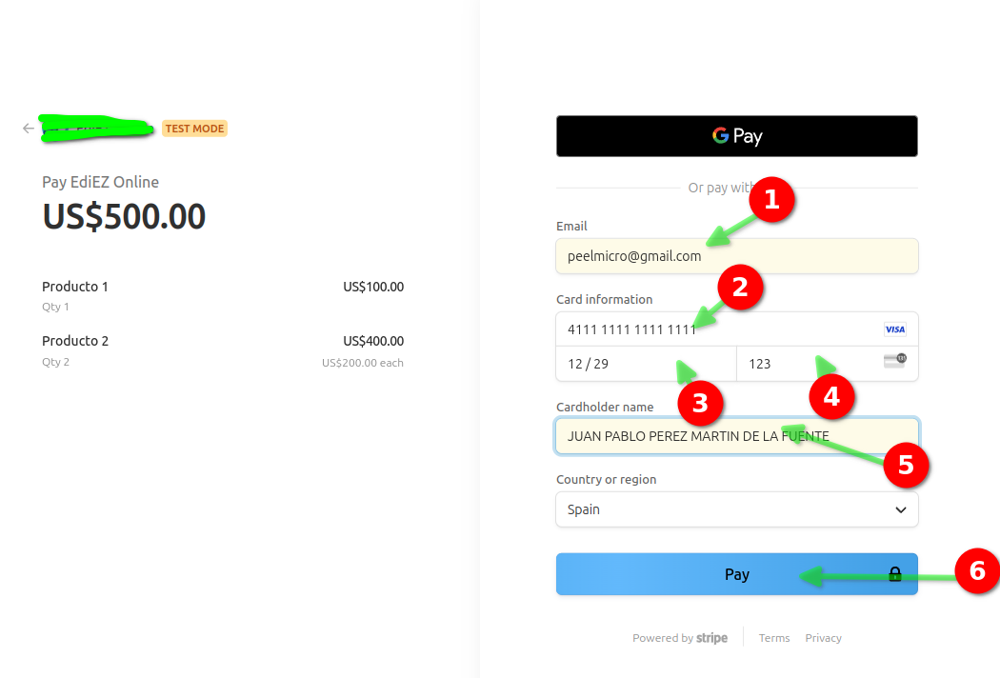

- Una vez que metemos los datos y clicamos en el botón de `Pay` nos redirigirá a la página de de success.

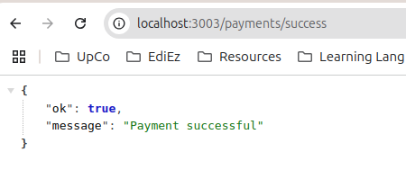

- Si entramos en el dashboard de Stripe podemos ver el pago.

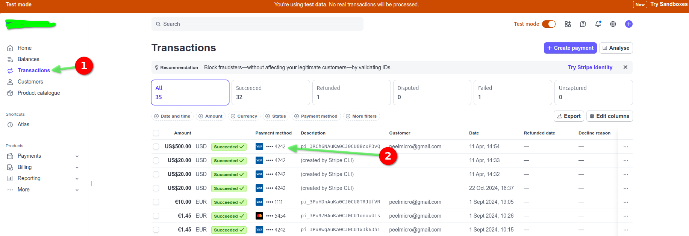

### 07.10 Creación de un webhook en Stripe

#### 07.10.01 Necesitamos crear un endpoint en nuestro microservicio para recibir el webhook de Stripe

- En producción, necesitamos crear un endpoint en nuestro microservicio para recibir el webhook de Stripe.
- En desarrollo, podemos usar el endpoint de Stripe CLI para recibir el webhook.
- Vamos a crear un endpoint en nuestro microservicio para recibir el webhook de Stripe.

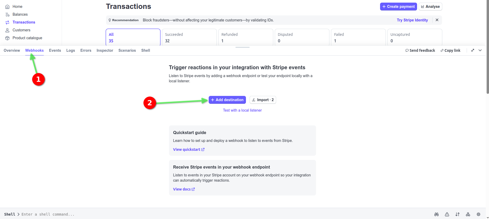

- Hay que seleccionar nuestra cuenta, la versión de API y los eventos que queremos recibir.

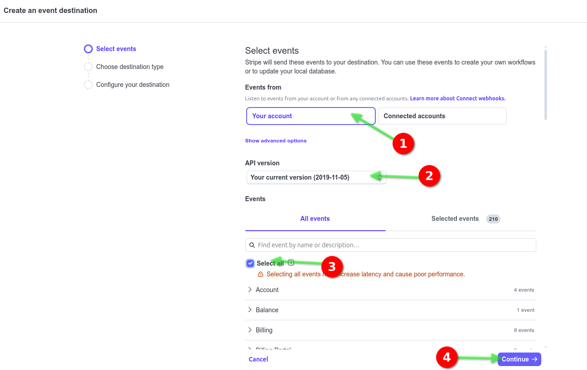

- Seleccionamos `Webhook endpoint`

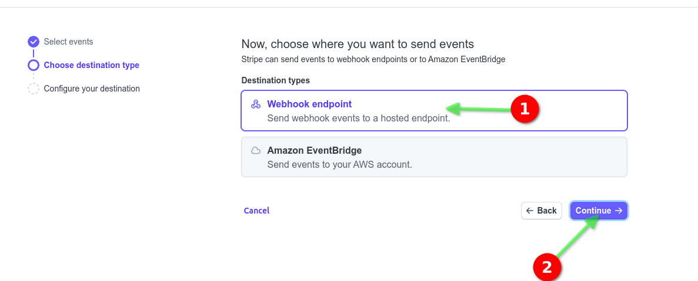

- Tenemos que seleccionar el endpoint que queremos utilizar.
- Tiene que ser un endpoint con `https://` por lo que no podemos usar localhost.
- Podemos utilizar ngrok o cloudflare para poder recibir el webhook de Stripe usando localhost en un dominio https.

```bash
ngrok http 3003
🛡️ Protect endpoints w/ IP Intelligence: https://ngrok.com/r/ipintel                                                                                                       
                                                                                                                                                                          
Session Status                online                                                                                                                                      
Account                       Juan Pablo perez (Plan: Personal)                                                                                                           
Update                        update available (version 3.22.1, Ctrl-U to update)                                                                                         
Version                       3.16.0                                                                                                                                      
Region                        Europe (eu)                                                                                                                                 
Latency                       33ms                                                                                                                                        
Web Interface                 http://127.0.0.1:4040                                                                                                                       
Forwarding                    https://785a51ab815f.ngrok.app -> http://localhost:3003                                                                                     
                                                                                                                                                                          
Connections                   ttl     opn     rt1     rt5     p50     p90                                                                                                 
                              0       0       0.00    0.00    0.00    0.00  
```

- Ponemos el dominio que nos proporciona ngrok y lo pegamos en el archivo `.env` en la variable `STRIPE_WEBHOOK_SECRET`.

- Copiamos el endpoint y lo pegamos en el archivo `.env` en la variable `STRIPE_WEBHOOK_SECRET`.

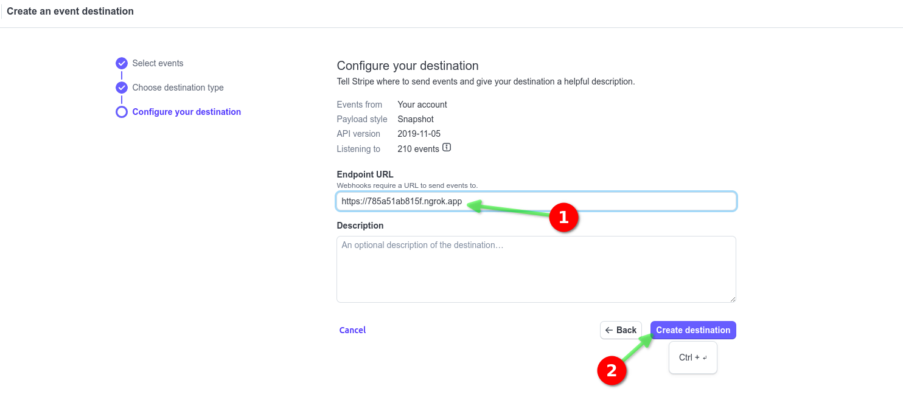

- Vemos que el webhook se ha creado correctamente.
- Necesitamos copiar el `signing secret` y lo pegamos en el archivo `.env` en la variable `STRIPE_ENDPOINT_SECRET`.

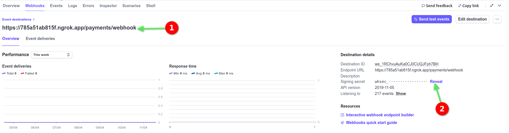

#### 07.10.02 Modificar el documento `main.ts` para recibir correctamente el webhook de Stripe

- Vamos a modificar el documento `main.ts` en el directorio `02-Products-App/payments-ms/src/main.ts` para recibir correctamente el webhook de Stripe.

> 02-Products-App/payments-ms/src/main.ts

```typescript
.
  const app = await NestFactory.create(AppModule, {
    rawBody: true
  });
.
```

#### 07.10.03 Modificar el documento `payments.service.ts` para recibir el webhook de Stripe

- Vamos a modificar el documento `payments.service.ts` en el directorio `02-Products-App/payments-ms/src/payments` para recibir el webhook de Stripe.

> 02-Products-App/payments-ms/src/payments/payments.service.ts  

```typescript
import { Injectable, Logger } from '@nestjs/common';
import { Request, Response } from 'express';
import { PaymentSessionDto } from './dto/payment-session.dto';
import { envs } from 'src/config/envs';
import Stripe from 'stripe';

@Injectable()
export class PaymentsService {
  private readonly logger = new Logger(PaymentsService.name);
  private readonly stripe = new Stripe(envs.stripeSecret);

  async createPaymentSession(paymentSessionDto: PaymentSessionDto) {
    const { currency, items, orderId } = paymentSessionDto;

    const lineItems = items.map((item) => {
      return {
        price_data: {
          currency: currency,
          product_data: {
            name: item.name,
          },
          unit_amount: Math.round(item.price * 100), // 20 dólares 2000 / 100 = 20.00 // 15.0000
        },
        quantity: item.quantity,
      };
    });

    const session = await this.stripe.checkout.sessions.create({
      // Colocar aquí el ID de mi orden
      payment_intent_data: {
        metadata: {
          orderId: orderId,
        },
      },
      line_items: lineItems,
      mode: 'payment',
      success_url: envs.stripeSuccessUrl,
      cancel_url: envs.stripeCancelUrl,
    });

    return session;
  }

  async stripeWebhook(req: Request, res: Response) {
    const sig = req.headers['stripe-signature'];

    if (!sig) {
      this.logger.error('Missing stripe signature');
      return res.status(400).send({ error: 'Missing stripe signature' });
    }

    let event: Stripe.Event;

    // Real
    const endpointSecret = envs.stripeEndpointSecret;

    try {
      event = this.stripe.webhooks.constructEvent(
        req['rawBody'],
        sig,
        endpointSecret,
      );
      if (!event) {
        this.logger.error('Invalid event');
        return res.status(400).send({ error: 'Invalid event' });
      }
    } catch (err) {
      this.logger.error(`Webhook Error: ${err.message}`);
      res.status(400).send({ error: `Webhook Error: ${err.message}` });
      return;
    }

    this.logger.log(`Event type received: ${event.type}`);

    switch (event.type) {
      case 'charge.succeeded':
        const chargeSucceeded = event.data.object;
        // TODO: llamar nuestro microservicio
        this.logger.log({
          metadata: chargeSucceeded.metadata,
          orderId: chargeSucceeded.metadata.orderId,
        });
        break;

      default:
        this.logger.log(`Event ${event.type} not handled`);
    }

    return res.status(200).json({ sig });
  }
}
```

#### 07.10.04 Modificar el documento `payments.controller.ts` para recibir el webhook de Stripe

- Vamos a modificar el documento `payments.controller.ts` en el directorio `02-Products-App/payments-ms/src/payments` para recibir el webhook de Stripe.

> 02-Products-App/payments-ms/src/payments/payments.controller.ts

```typescript
import { Controller, Get, Post, Req, Res, Body, Logger } from '@nestjs/common';
import { PaymentsService } from './payments.service';
import { PaymentSessionDto } from './dto/payment-session.dto';
import { Request, Response } from 'express'

@Controller('payments')
export class PaymentsController {

  private readonly logger = new Logger(PaymentsController.name);

  constructor(private readonly paymentsService: PaymentsService) {}

  @Post('create-payment-session')
  createPaymentSession(@Body() paymentSessionDto: PaymentSessionDto ) {
    return this.paymentsService.createPaymentSession(paymentSessionDto);
  }

  @Get('success')
  success() {
    return {
      ok: true,
      message: 'Payment successful'
    }
  }

  @Get('cancel')
  cancel() {
    return {
      ok: false,
      message: 'Payment cancelled'
    }
  }


  @Post('webhook')
  async stripeWebhook(@Req() req: Request, @Res() res: Response) {
    return this.paymentsService.stripeWebhook(req, res);
  }  
}
```

#### 07.10.05 Probar el webhook de Stripe

- Vamos a probar el webhook de Stripe utilizando el archivo `payments.http` y mandando una petición de sesión de pago.

```bash
@url = http://localhost:3003/payments

### Crear una sesión de pago
POST {{url}}/create-payment-session
Content-Type: application/json

{
  "orderId": "1234567890",
  "currency": "USD",
  "items": [
    {   
      "name": "Producto 1",
      "price": 100,
      "quantity": 1
    },
    {
      "name": "Producto 2",
      "price": 200,
      "quantity": 2
    }
  ]
}
```

- Vamos a copiar el `url` de la respuesta y lo pegamos en el navegador.
- Vamos a pagar desde el navegador.
- Podemos ver los logs en el terminal.

```bash
[Nest] 676533  - 11/04/2025, 16:40:49     LOG [PaymentsService] Event type received: charge.succeeded
[Nest] 676533  - 11/04/2025, 16:40:49     LOG [PaymentsService] Object(2) {
  metadata: {
    orderId: '1234567890'
  },
  orderId: '1234567890'
}
[Nest] 676533  - 11/04/2025, 16:40:50     LOG [PaymentsService] Event type received: payment_intent.succeeded
[Nest] 676533  - 11/04/2025, 16:40:50     LOG [PaymentsService] Event payment_intent.succeeded not handled
[Nest] 676533  - 11/04/2025, 16:40:50     LOG [PaymentsService] Event type received: checkout.session.completed
[Nest] 676533  - 11/04/2025, 16:40:50     LOG [PaymentsService] Event checkout.session.completed not handled
```
