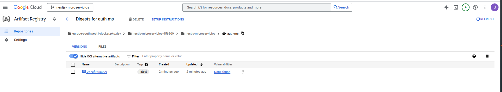
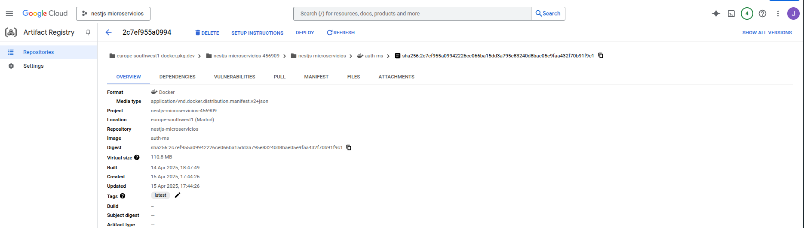
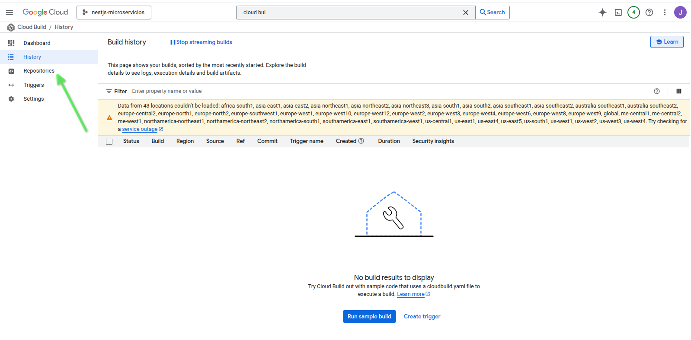
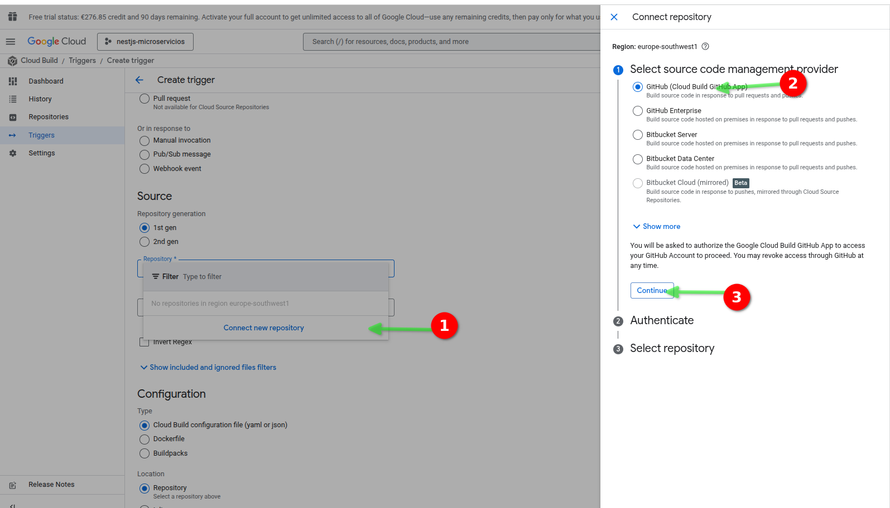
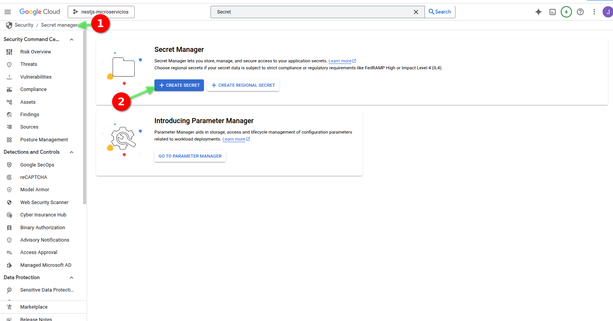

# NestJS + Microservicios: Aplicaciones escalables y modulares (parte 11)

- En este documento vamos a documentar el curso [NestJS + Microservicios: Aplicaciones escalables y modulares de Udemy](https://www.udemy.com/course/nestjs-microservicios)

## 11 CI/CD con Google Cloud Platform

### 11.01 Introducción

- Vamos a crear utilizar Google Cloud Platform para implementar nuestro CI/CD.
- Tenemos que instalar `gcloud cli` y hacer login con nuestro usuario de Google Cloud Platform.
- Tenemos que subir nuestras imágenes a Google Container Registry.
- Vamos a definir cómo se suben imágenes con `secrets`.

### 11.02 Crear una nueva cuenta en Google Cloud para aprovechar el bono de $300

- Accediendo a [Google Cloud](https://cloud.google.com/), hacemos click en `Start free`.


- Ingresamos con nuestro correo electrónico y contraseña y clicamos en `Agree and continue`.


- Tenemos que crear un perfil de pago.


- Tenemos que poner nuestro número de identificación fiscal y añadir nuestro método de pago. Luego clicamos en `Start free`.


- Se muestra una ventana donde nos indica que tenemos que verificar nuestra cuenta. Clicar en `Continue`.


- Una vez que se ha verificado la tarjeta de crédito, nos muestra la pantalla de bienvenida a Google Cloud Platform.


### 11.03 Crear un proyecto en Google Cloud Platform

- Tenemos que crear un proyecto nuevo.


- Le ponemos un nombre al proyecto, por ejemplo `nestjs-microservicios`. Luego clicamos en `Create`.


- Tenemos que seleccionar el nuevo proyecto en la lista de proyectos.


- Tenemos que asegurarnos de que el proyecto esté activo.


### 11.04 Configurar Docker Container Registry de Google Cloud Platform

- Buscamos por `Container Registry` y lo seleccionamos. Luego tenemos que habilitar el uso de `Google Container Registry API`.


- Después de habilitar la API, nos muestra la pantalla de `Artifact Registry API`. También tenemos que habilitarla.


- Luego pregunta si queremos habilitar el escaneo de imágenes (Turn on vulnerability scanning). Debemos hacerlo.


- Tenemos que crear un repositorio nuevo clicando en `Create repository`.


- Le ponemos un nombre al repositorio, por ejemplo `nestjs-microservicios` y el resto de las opciones según se muestran en las imágenes. Luego clicamos en `Create`


- Podemos ver el repositorio que hemos creado.


- Podemos ver los detalles del repositorio, donde podemos ver el `URI` del repositorio.


- `URL folder`: europe-southwest1-docker.pkg.dev/nestjs-microservicios-456909/nestjs-microservicios

- Podemos ver las instrucciones para subir imágenes a nuestro repositorio clicando en `SETUP INSTRUCTIONS`.


- Vemos las instrucciones para instalar `gcloud cli` y hacer login con nuestro usuario de Google Cloud Platform.


- Tenemos que instalar `gcloud cli` y hacer login con nuestro usuario de Google Cloud Platform.

```bash
gcloud auth configure-docker \
    europe-southwest1-docker.pkg.dev
```

### 11.05 Instalar gcloud cli y hacer login con nuestro usuario de Google Cloud Platform

- Tenemos que crear comprobar si tenemos instalado `gcloud cli` y qué versión tenemos.

```bash
gcloud version
Google Cloud SDK 492.0.0
alpha 2024.09.06
beta 2024.09.06
bq 2.1.8
bundled-python3-unix 3.11.9
core 2024.09.06
gcloud-crc32c 1.0.0
gsutil 5.30


To take a quick anonymous survey, run:
  $ gcloud survey
```

### 11.06 Inicializar el proyecto en Google Cloud Platform

#### 11.06.01 Deberíamos comprobar si tenemos una cuenta configurada en nuestra máquina con este comando:

```bash
gcloud auth list
  Credentialed Accounts
ACTIVE  ACCOUNT
*       info@ediez.online

```

#### 11.06.02 Si no tenemos una cuenta configurada, hacemos login con nuestro usuario de Google Cloud Platform.

```bash
gcloud auth list
  Credentialed Accounts
ACTIVE  ACCOUNT
*       ixxo@exxxz.onxxne
```

- Si vemos que esa cuenta tenemos que loguearnos con la nueva cuenta haciendo:

```bash
gcloud auth login --account=your-test-account@email.com
```

- Para volver otra vez a cuenta anterior hacemos:

```bash
gcloud auth login --account=ixxo@exxxz.onxxne
```

#### 11.06.03 Configurar los projectos

- También podríamos crear configuraciones para cada projecto:
- Para el nuevo projecto:

```bash
gcloud config configurations create nestjs-microservicios
gcloud config set account your-test-account@email.com
gcloud config set project nestjs-microservicio-project-id
```

- Para volver el projecto de producción:

```bash
gcloud config configurations create production
gcloud config set account ixxo@exxxz.onxxne
gcloud config set project production-project-id
```

- Una vez creados los projectos, podemos iniciar cada uno de ellos con los commandos:

```bash
cloud config configurations activate nestjs-microservicios
```

o

```bash
gcloud config configurations activate production
```

#### 11.06.04 Creación de las configuraciones de producción

- Vamos a crear la configuración de producción:

```bash
~/Training/microservices/nestjs-microservicios/02-Products-App$
gcloud config configurations create production
Created [production].
Activated [production].
```

- Configuración de la cuenta de producción:

```bash
~/Training/microservices/nestjs-microservicios/02-Products-App$
gcloud config set account ixxo@exxxz.onxxne
Updated property [core/account].
```

- Configuración del projecto de producción:

```bash
~/Training/microservices/nestjs-microservicios/02-Products-App$ 
gcloud config set project production-project-id
Updated property [core/project].
```

#### 11.06.05 Creación de la configuración de desarrollo

- Vamos a crear la configuración de desarrollo:

```bash
~/Training/microservices/nestjs-microservicios/02-Products-App$ 
gcloud config configurations create nestjs-microservicios
Created [nestjs-microservicios].
Activated [nestjs-microservicios].
```

- Configuración de la cuenta de desarrollo:

```bash
~/Training/microservices/nestjs-microservicios/02-Products-App$ 
gcloud config set account your-test-account@email.com
Updated property [core/account].
```

- Login con nuestro usuario de Google Cloud Platform de desarrollo:

```bash
~/Training/microservices/nestjs-microservicios/02-Products-App$ gcloud auth login --account=your-test-account@email.com
Your browser has been opened to visit:

    https://accounts.google.com/o/oauth2/auth?response_type=code&client_id=32555940559.apps.googleusercontent.com&redirect_uri=http%3A%2F%2Flocalhost%3A8085%2F&scope=openid+https%3A%2F%2Fwww.googleapis.com%2Fauth%2Fuserinfo.email+https%3A%2F%2Fwww.googleapis.com%2Fauth%2Fcloud-platform+https%3A%2F%2Fwww.googleapis.com%2Fauth%2Fappengine.admin+https%3A%2F%2Fwww.googleapis.com%2Fauth%2Fsqlservice.login+https%3A%2F%2Fwww.googleapis.com%2Fauth%2Fcompute+https%3A%2F%2Fwww.googleapis.com%2Fauth%2Faccounts.reauth&state=8TzLXE6dAVc43mynKftAIKnwNHkPjI&access_type=offline&code_challenge=cl51PWnVD8CG5O--zMAXMrRzGZqTgoh__V7FqLpx_mI&code_challenge_method=S256


You are now logged in as [your-test-account@email.com].
Your current project is [None].  You can change this setting by running:
  $ gcloud config set project PROJECT_ID
```

- Configuración del projecto de desarrollo:

```bash
~/Training/microservices/nestjs-microservicios/02-Products-App$ 
gcloud config set project nestjs-microservicios-456909
Updated property [core/project].
```

#### 11.06.06 Seleccionar el projecto de producción

```bash
~/Training/microservices/nestjs-microservicios/02-Products-App$ 
gcloud config configurations activate production
Activated [production].
```

- Tenemos que asegurarnos de que estamos en el projecto de producción:

```bash
~/Training/microservices/nestjs-microservicios/02-Products-App$ 
gcloud config list
[core]
account = ixxo@exxxz.onxxne
disable_usage_reporting = True
project = production-project-id

Your active configuration is: [production]
```

- Por si acaso, también nos podemos autenticar con nuestro usuario de Google Cloud Platform de producción:

```bash
~/Training/microservices/nestjs-microservicios/02-Products-App$ 
gcloud auth login --account=ixxo@exxxz.onxxne
```

#### 11.06.07 Seleccionar el projecto de desarrollo

```bash
~/Training/microservices/nestjs-microservicios/02-Products-App$ 
gcloud config configurations activate nestjs-microservicios
Activated [nestjs-microservicios].
```

- Tenemos que asegurarnos de que estamos en el projecto de desarrollo:

```bash
~/Training/microservices/nestjs-microservicios/02-Products-App$ 
gcloud config list
gcloud config list
[core]
account = your-test-account@email.com
disable_usage_reporting = True
project = nestjs-microservicios-456909

Your active configuration is: [nestjs-microservicios]
```

### 11.07 Inicializar el proyecto en Google Cloud Platform

- Vamos a inicializar el proyecto en Google Cloud Platform:
- Tenemos que asegurarnos de que estamos en el projecto de desarrollo:

```bash
~/Training/microservices/nestjs-microservicios/02-Products-App$ 
gcloud config configurations activate nestjs-microservicios
Activated [nestjs-microservicios].
```

- Y ahora inicializamos el proyecto:

```bash
~/Training/microservices/nestjs-microservicios/02-Products-App$ 
gcloud init
Welcome! This command will take you through the configuration of gcloud.

Settings from your current configuration [nestjs-microservicios] are:
core:
  account: your-test-account@email.com
  disable_usage_reporting: 'True'
  project: nestjs-microservicios-456909

Pick configuration to use:
 [1] Re-initialize this configuration [nestjs-microservicios] with new settings 
 [2] Create a new configuration
 [3] Switch to and re-initialize existing configuration: [default]
 [4] Switch to and re-initialize existing configuration: [production]
Please enter your numeric choice:  1

Your current configuration has been set to: [nestjs-microservicios]

You can skip diagnostics next time by using the following flag:
  gcloud init --skip-diagnostics

Network diagnostic detects and fixes local network connection issues.
Checking network connection...done.                                                                                                                      
Reachability Check passed.
Network diagnostic passed (1/1 checks passed).

Choose the account you want to use for this configuration.
To use a federated user account, exit this command and sign in to the gcloud CLI with your login configuration file, then run this command again.

Select an account:
 [1] ixxo@exxxz.onxxne
 [2] your-test-account@email.com
 [3] Sign in with a new Google Account
 [4] Skip this step
Please enter your numeric choice:  2

You are signed in as: [your-test-account@email.com].

Pick cloud project to use: 
 [1] favorable-array-456909-u4
 [2] nestjs-microservicios-456909
 [3] Enter a project ID
 [4] Create a new project
Please enter numeric choice or text value (must exactly match list item):  2

Your current project has been set to: [nestjs-microservicios-456909].

Not setting default zone/region (this feature makes it easier to use
[gcloud compute] by setting an appropriate default value for the
--zone and --region flag).
See https://cloud.google.com/compute/docs/gcloud-compute section on how to set
default compute region and zone manually. If you would like [gcloud init] to be
able to do this for you the next time you run it, make sure the
Compute Engine API is enabled for your project on the
https://console.developers.google.com/apis page.

The Google Cloud CLI is configured and ready to use!

* Commands that require authentication will use juan.pablo.perez.aws.2025@gmail.com by default
* Commands will reference project `nestjs-microservicios-456909` by default
Run `gcloud help config` to learn how to change individual settings

This gcloud configuration is called [nestjs-microservicios]. You can create additional configurations if you work with multiple accounts and/or projects.
Run `gcloud topic configurations` to learn more.

Some things to try next:

* Run `gcloud --help` to see the Cloud Platform services you can interact with. And run `gcloud help COMMAND` to get help on any gcloud command.
* Run `gcloud topic --help` to learn about advanced features of the CLI like arg files and output formatting
* Run `gcloud cheat-sheet` to see a roster of go-to `gcloud` commands.
```

### 11.08 Configurar el Artifact Registry según las instrucciones de Google Cloud Platform

- Vamos a configurar el Artifact Registry según las instrucciones de Google Cloud Platform:

```bash
~/Training/microservices/nestjs-microservicios/02-Products-App$ 
gcloud auth configure-docker \
    europe-southwest1-docker.pkg.dev
WARNING: Your config file at [/home/juanpabloperez/.docker/config.json] contains these credential helper entries:

{
  "credHelpers": {
    "asia.gcr.io": "gcloud",
    "eu.gcr.io": "gcloud",
    "europe-southwest1-docker.pkg.dev": "gcloud",
    "europe-west1-docker.pkg.dev": "gcloud",
    "gcr.io": "gcloud",
    "marketplace.gcr.io": "gcloud",
    "staging-k8s.gcr.io": "gcloud",
    "us.gcr.io": "gcloud"
  }
}
Adding credentials for: europe-southwest1-docker.pkg.dev
gcloud credential helpers already registered correctly.    
```

### 11.09 Subir imágenes a Google Container Registry

#### 11.09.01 Subir la imagen the `auth-ms`

- Vamos a subir una imagen a Google Container Registry.
- Se puede hacer de forma manual utilizando el comando `docker build` y `docker push`.
- El nombre de la imagen es `europe-southwest1-docker.pkg.dev/nestjs-microservicios-456909/nestjs-microservicios/auth-ms:latest`, que es el nombre del repositorio de Google Container Registry junto con el nombre de la imagen y la etiqueta.
- Tenemos que estar en el directorio del proyecto y ejecutar el comando:

```bash
~/Training/microservices/nestjs-microservicios/02-Products-App//auth-ms$ 
docker build -f dockerfile.prod -t europe-southwest1-docker.pkg.dev/nestjs-microservicios-456909/nestjs-microservicios/auth-ms:latest .
[+] Building 1.3s (17/17) FINISHED                                                                                                                   docker:desktop-linux
 => [internal] load build definition from dockerfile.prod                                                                                                            0.0s
 => => transferring dockerfile: 840B                                                                                                                                 0.0s
 => [internal] load metadata for docker.io/library/node:22-alpine                                                                                                    1.2s
 => [internal] load .dockerignore                                                                                                                                    0.0s
 => => transferring context: 73B                                                                                                                                     0.0s
 => [internal] load build context                                                                                                                                    0.0s
 => => transferring context: 1.31kB                                                                                                                                  0.0s
 => [deps 1/5] FROM docker.io/library/node:22-alpine@sha256:9bef0ef1e268f60627da9ba7d7605e8831d5b56ad07487d24d1aa386336d1944                                         0.0s
 => CACHED [deps 2/5] WORKDIR /usr/src/app                                                                                                                           0.0s
 => CACHED [deps 3/5] COPY package.json ./                                                                                                                           0.0s
 => CACHED [deps 4/5] COPY package-lock.json ./                                                                                                                      0.0s
 => CACHED [deps 5/5] RUN npm install                                                                                                                                0.0s
 => CACHED [build 3/7] COPY --from=deps /usr/src/app/node_modules ./node_modules                                                                                     0.0s
 => CACHED [build 4/7] COPY . .                                                                                                                                      0.0s
 => CACHED [build 5/7] RUN npx prisma generate                                                                                                                       0.0s
 => CACHED [build 6/7] RUN npm run build                                                                                                                             0.0s
 => CACHED [build 7/7] RUN npm ci -f --only=production && npm cache clean --force                                                                                    0.0s
 => CACHED [prod 3/4] COPY --from=build /usr/src/app/node_modules ./node_modules                                                                                     0.0s
 => CACHED [prod 4/4] COPY --from=build /usr/src/app/dist ./dist                                                                                                     0.0s
 => exporting to image                                                                                                                                               0.0s
 => => exporting layers                                                                                                                                              0.0s
 => => writing image sha256:7226130387efc213b2c5b5bd17c02d9c4dba51226c33621907c5c8d5ce4dcc89                                                                         0.0s
 => => naming to europe-southwest1-docker.pkg.dev/nestjs-microservicios-456909/nestjs-microservicios/auth-ms:latest                                                  0.0s

View build details: docker-desktop://dashboard/build/desktop-linux/desktop-linux/sxijxqdtjivvph0uqxwwnhpez

What's next:
    View a summary of image vulnerabilities and recommendations → docker scout quickview 
```

- Ahora tenemos que subir la imagen a Google Container Registry utilizando el comando `docker push`:

```bash
~/Training/microservices/nestjs-microservicios/02-Products-App/auth-ms$ 
docker push europe-southwest1-docker.pkg.dev/nestjs-microservicios-456909/nestjs-microservicios/auth-ms:latest
The push refers to repository [europe-southwest1-docker.pkg.dev/nestjs-microservicios-456909/nestjs-microservicios/auth-ms]
8da66be4a3ce: Pushed 
05ea677bc150: Pushed 
0ee687424fdc: Pushed 
224bd9b34beb: Pushed 
d5fa9fb24593: Pushed 
5b1aa58ce982: Pushed 
08000c18d16d: Pushed 
latest: digest: sha256:2c7ef955a09942226ce066ba15dd3a795e83240d8bae05e9faa432f70b91f9c1 size: 1786
```

- podemos ver la imagen en el repositorio de Google Container Registry:


- Podemos ver las imágenes de `auth-ms` que tenemos en el repositorio de Google Container Registry:



- Podemos ver el contenido de la imagen seleccionada de `auth-ms` que tenemos en el repositorio de Google Container Registry:



#### 11.09.02 Modificar el archivo `docker-compose.prod.yaml` para generar todas las imágenes de forma semiautomática

- Vamos a añadir en el archvio `.env` la variable de entorno `DOCKER_REGISTRY_SERVER` con el valor de `europe-southwest1-docker.pkg.dev`.

> 02-Products-App/.env

```text
.
DOCKER_REGISTRY_SERVER=europe-southwest1-docker.pkg.dev
DOCKER_PROJECT_ID=nestjs-microservicios-456909
DOCKER_REGISTRY_PROJECT=nestjs-microservicios
```

- Vamos a modificar el archivo `docker-compose.prod.yaml` para generar todas las imágenes de forma semiautomática.

> 02-Products-App/docker-compose.prod.yaml

```yaml
services:

  nats-server:
    image: nats:latest
    
  client-gateway:
    build:
      context: ./client-gateway
      dockerfile: dockerfile.prod
    image: ${DOCKER_REGISTRY_SERVER}/${DOCKER_PROJECT_ID}/${DOCKER_REGISTRY_PROJECT}/client-gateway-prod
    ports:
      - ${CLIENT_GATEWAY_PORT}:${CLIENT_GATEWAY_PORT}
    environment:
      - PORT=${CLIENT_GATEWAY_PORT}
      - NATS_SERVERS=${NATS_SERVERS}

  auth-ms:
    build:
      context: ./auth-ms
      dockerfile: dockerfile.prod
    image: ${DOCKER_REGISTRY_SERVER}/${DOCKER_PROJECT_ID}/${DOCKER_REGISTRY_PROJECT}/auth-ms
    environment:
      - PORT=3000
      - NATS_SERVERS=${NATS_SERVERS}
      - AUTH_DATABASE_URL=${AUTH_DATABASE_URL}
      - JWT_SECRET=${JWT_SECRET}

  products-ms:
    build:
      context: ./products-ms
      dockerfile: dockerfile.prod
    image: ${DOCKER_REGISTRY_SERVER}/${DOCKER_PROJECT_ID}/${DOCKER_REGISTRY_PROJECT}/products-ms
    environment:
      - PORT=3000
      - NATS_SERVERS=${NATS_SERVERS}
      - PRODUCTS_DATABASE_URL=${PRODUCTS_DATABASE_URL}
  
  orders-ms:
    build: 
      context: ./orders-ms
      dockerfile: dockerfile.prod
      args:
        - ORDERS_DATABASE_URL=${ORDERS_DATABASE_URL}
    image: ${DOCKER_REGISTRY_SERVER}/${DOCKER_PROJECT_ID}/${DOCKER_REGISTRY_PROJECT}/orders-ms
    environment:
      - PORT=3000
      - ORDERS_DATABASE_URL=${ORDERS_DATABASE_URL}
      - NATS_SERVERS=${NATS_SERVERS}

  payments-ms:
    build:
      context: ./payments-ms
      dockerfile: dockerfile.prod
    image: ${DOCKER_REGISTRY_SERVER}/${DOCKER_PROJECT_ID}/${DOCKER_REGISTRY_PROJECT}/payments-ms
    ports:
      - ${PAYMENTS_MS_PORT}:${PAYMENTS_MS_PORT}
    environment:
      - PORT=${PAYMENTS_MS_PORT}
      - NATS_SERVERS=${NATS_SERVERS}
      - STRIPE_SECRET=${STRIPE_SECRET}
      - STRIPE_SUCCESS_URL=${STRIPE_SUCCESS_URL}
      - STRIPE_CANCEL_URL=${STRIPE_CANCEL_URL}
      - STRIPE_ENDPOINT_SECRET=${STRIPE_ENDPOINT_SECRET}
      
```

- Vamos a ejecutar el comando `docker compose -f docker-compose.prod.yaml build` para generar todas las imágenes de forma semiautomática.

```bash
~/Training/microservices/nestjs-microservicios/02-Products-App$ 
docker compose -f docker-compose.prod.yaml build
Compose can now delegate builds to bake for better performance.
 To do so, set COMPOSE_BAKE=true.
[+] Building 1.6s (78/78) FINISHED                                                                                                                   docker:desktop-linux
 => [products-ms internal] load build definition from dockerfile.prod                                                                                                0.0s
 => => transferring dockerfile: 880B                                                                                                                                 0.0s
 => [orders-ms internal] load build definition from dockerfile.prod                                                                                                  0.0s
 => => transferring dockerfile: 1.01kB                                                                                                                               0.0s
 => [payments-ms internal] load build definition from dockerfile.prod                                                                                                0.0s
 => => transferring dockerfile: 816B                                                                                                                                 0.0s
 => [client-gateway internal] load build definition from dockerfile.prod                                                                                             0.0s
 => => transferring dockerfile: 816B                                                                                                                                 0.0s
 => [auth-ms internal] load build definition from dockerfile.prod                                                                                                    0.0s
 => => transferring dockerfile: 840B                                                                                                                                 0.0s
 => [products-ms internal] load metadata for docker.io/library/node:22-alpine                                                                                        1.2s
 => [client-gateway internal] load .dockerignore                                                                                                                     0.0s
 => => transferring context: 73B                                                                                                                                     0.0s
 => [payments-ms internal] load .dockerignore                                                                                                                        0.0s
 => => transferring context: 73B                                                                                                                                     0.0s
 => [products-ms internal] load .dockerignore                                                                                                                        0.0s
 => => transferring context: 73B                                                                                                                                     0.0s
 => [auth-ms internal] load .dockerignore                                                                                                                            0.0s
 => => transferring context: 73B                                                                                                                                     0.0s
 => [orders-ms internal] load .dockerignore                                                                                                                          0.1s
 => => transferring context: 73B                                                                                                                                     0.0s
 => [orders-ms deps 1/5] FROM docker.io/library/node:22-alpine@sha256:9bef0ef1e268f60627da9ba7d7605e8831d5b56ad07487d24d1aa386336d1944                               0.0s
 => [client-gateway internal] load build context                                                                                                                     0.0s
 => => transferring context: 2.72kB                                                                                                                                  0.0s
 => [auth-ms internal] load build context                                                                                                                            0.0s
 => => transferring context: 1.31kB                                                                                                                                  0.0s
 => [payments-ms internal] load build context                                                                                                                        0.0s
 => => transferring context: 1.20kB                                                                                                                                  0.0s
 => [products-ms internal] load build context                                                                                                                        0.0s
 => => transferring context: 1.69kB                                                                                                                                  0.0s
 => [orders-ms internal] load build context                                                                                                                          0.0s
 => => transferring context: 2.43kB                                                                                                                                  0.0s
 => CACHED [client-gateway deps 2/5] WORKDIR /usr/src/app                                                                                                            0.0s
 => CACHED [orders-ms deps 3/5] COPY package.json ./                                                                                                                 0.0s
 => CACHED [orders-ms deps 4/5] COPY package-lock.json ./                                                                                                            0.0s
 => CACHED [orders-ms deps 5/5] RUN npm install                                                                                                                      0.0s
 => CACHED [orders-ms build 3/8] COPY --from=deps /usr/src/app/node_modules ./node_modules                                                                           0.0s
 => CACHED [orders-ms build 4/8] COPY . .                                                                                                                            0.0s
 => CACHED [orders-ms build 5/8] RUN npx prisma migrate deploy                                                                                                       0.0s
 => CACHED [orders-ms build 6/8] RUN npx prisma generate                                                                                                             0.0s
 => CACHED [orders-ms build 7/8] RUN npm run build                                                                                                                   0.0s
 => CACHED [orders-ms build 8/8] RUN npm ci -f --only=production && npm cache clean --force                                                                          0.0s
 => CACHED [orders-ms prod 3/4] COPY --from=build /usr/src/app/node_modules ./node_modules                                                                           0.0s
 => CACHED [orders-ms prod 4/4] COPY --from=build /usr/src/app/dist ./dist                                                                                           0.0s
 => CACHED [products-ms deps 3/5] COPY package.json ./                                                                                                               0.0s
 => CACHED [products-ms deps 4/5] COPY package-lock.json ./                                                                                                          0.0s
 => CACHED [products-ms deps 5/5] RUN npm install                                                                                                                    0.0s
 => CACHED [products-ms build 3/7] COPY --from=deps /usr/src/app/node_modules ./node_modules                                                                         0.0s
 => CACHED [products-ms build 4/7] COPY . .                                                                                                                          0.0s
 => CACHED [products-ms build 5/7] RUN npx prisma generate                                                                                                           0.0s
 => CACHED [products-ms build 6/7] RUN npm run build                                                                                                                 0.0s
 => CACHED [products-ms build 7/7] RUN npm ci -f --only=production && npm cache clean --force                                                                        0.0s
 => CACHED [products-ms prod 3/5] COPY --from=build /usr/src/app/node_modules ./node_modules                                                                         0.0s
 => CACHED [products-ms prod 4/5] COPY --from=build /usr/src/app/dist ./dist                                                                                         0.0s
 => CACHED [products-ms prod 5/5] COPY --from=build /usr/src/app/prisma ./prisma                                                                                     0.0s
 => CACHED [auth-ms deps 3/5] COPY package.json ./                                                                                                                   0.0s
 => CACHED [auth-ms deps 4/5] COPY package-lock.json ./                                                                                                              0.0s
 => CACHED [auth-ms deps 5/5] RUN npm install                                                                                                                        0.0s
 => CACHED [auth-ms build 3/7] COPY --from=deps /usr/src/app/node_modules ./node_modules                                                                             0.0s
 => CACHED [auth-ms build 4/7] COPY . .                                                                                                                              0.0s
 => CACHED [auth-ms build 5/7] RUN npx prisma generate                                                                                                               0.0s
 => CACHED [auth-ms build 6/7] RUN npm run build                                                                                                                     0.0s
 => CACHED [auth-ms build 7/7] RUN npm ci -f --only=production && npm cache clean --force                                                                            0.0s
 => CACHED [auth-ms prod 3/4] COPY --from=build /usr/src/app/node_modules ./node_modules                                                                             0.0s
 => CACHED [auth-ms prod 4/4] COPY --from=build /usr/src/app/dist ./dist                                                                                             0.0s
 => CACHED [payments-ms deps 3/5] COPY package.json ./                                                                                                               0.0s
 => CACHED [payments-ms deps 4/5] COPY package-lock.json ./                                                                                                          0.0s
 => CACHED [payments-ms deps 5/5] RUN npm install                                                                                                                    0.0s
 => CACHED [payments-ms build 3/6] COPY --from=deps /usr/src/app/node_modules ./node_modules                                                                         0.0s
 => CACHED [payments-ms build 4/6] COPY . .                                                                                                                          0.0s
 => CACHED [payments-ms build 5/6] RUN npm run build                                                                                                                 0.0s
 => CACHED [payments-ms build 6/6] RUN npm ci -f --only=production && npm cache clean --force                                                                        0.0s
 => CACHED [payments-ms prod 3/4] COPY --from=build /usr/src/app/node_modules ./node_modules                                                                         0.0s
 => CACHED [payments-ms prod 4/4] COPY --from=build /usr/src/app/dist ./dist                                                                                         0.0s
 => CACHED [client-gateway deps 3/5] COPY package.json ./                                                                                                            0.0s
 => CACHED [client-gateway deps 4/5] COPY package-lock.json ./                                                                                                       0.0s
 => CACHED [client-gateway deps 5/5] RUN npm install                                                                                                                 0.0s
 => CACHED [client-gateway build 3/6] COPY --from=deps /usr/src/app/node_modules ./node_modules                                                                      0.0s
 => CACHED [client-gateway build 4/6] COPY . .                                                                                                                       0.0s
 => CACHED [client-gateway build 5/6] RUN npm run build                                                                                                              0.0s
 => CACHED [client-gateway build 6/6] RUN npm ci -f --only=production && npm cache clean --force                                                                     0.0s
 => CACHED [client-gateway prod 3/4] COPY --from=build /usr/src/app/node_modules ./node_modules                                                                      0.0s
 => CACHED [client-gateway prod 4/4] COPY --from=build /usr/src/app/dist ./dist                                                                                      0.0s
 => [client-gateway] exporting to image                                                                                                                              0.0s
 => => exporting layers                                                                                                                                              0.0s
 => => writing image sha256:d1ae7e0a74ea83f6096564009e0d7412630b32d25047b620e7f3bec770054588                                                                         0.0s
 => => naming to europe-southwest1-docker.pkg.dev/nestjs-microservicios-456909/nestjs-microservicios/client-gateway-prod                                             0.0s
 => [auth-ms] exporting to image                                                                                                                                     0.0s
 => => exporting layers                                                                                                                                              0.0s
 => => writing image sha256:12c44b1f5297cbf3b587bb11f9d7028dae160ddb34c3c91be680e82097692074                                                                         0.0s
 => => naming to europe-southwest1-docker.pkg.dev/nestjs-microservicios-456909/nestjs-microservicios/auth-ms                                                         0.0s
 => [products-ms] exporting to image                                                                                                                                 0.0s
 => => exporting layers                                                                                                                                              0.0s
 => => writing image sha256:9aa84fa5a6d12ad3a494fc8a754e44aa9943f4a7dd8ecaccc19715756eddc082                                                                         0.0s
 => => naming to europe-southwest1-docker.pkg.dev/nestjs-microservicios-456909/nestjs-microservicios/products-ms                                                     0.0s
 => [payments-ms] exporting to image                                                                                                                                 0.1s
 => => exporting layers                                                                                                                                              0.0s
 => => writing image sha256:9895588f1b54cc544a3fcd3abfac626b90a20f27e5075bdc823eccf581cb6048                                                                         0.0s
 => => naming to europe-southwest1-docker.pkg.dev/nestjs-microservicios-456909/nestjs-microservicios/payments-ms                                                     0.0s
 => [orders-ms] exporting to image                                                                                                                                   0.1s
 => => exporting layers                                                                                                                                              0.0s
 => => writing image sha256:5627e5799699beb3c1660d083bc73a123cac151a7ef960905deb28805c774976                                                                         0.0s
 => => naming to europe-southwest1-docker.pkg.dev/nestjs-microservicios-456909/nestjs-microservicios/orders-ms                                                       0.0s
 => [client-gateway] resolving provenance for metadata file                                                                                                          0.1s
 => [auth-ms] resolving provenance for metadata file                                                                                                                 0.0s
 => [products-ms] resolving provenance for metadata file                                                                                                             0.0s
 => [payments-ms] resolving provenance for metadata file                                                                                                             0.0s
 => [orders-ms] resolving provenance for metadata file                                                                                                               0.0s
[+] Building 5/5
 ✔ auth-ms         Built                                                                                                                                             0.0s 
 ✔ client-gateway  Built                                                                                                                                             0.0s 
 ✔ orders-ms       Built                                                                                                                                             0.0s 
 ✔ payments-ms     Built                                                                                                                                             0.0s 
 ✔ products-ms     Built  
```

- Vamos a subir las imágenes a Google Container Registry utilizando el comando `docker push` de la misma forma que lo hicimos en el apartado anterior.

```bash
~/Training/microservices/nestjs-microservicios/02-Products-App/client-gateway$
docker push europe-southwest1-docker.pkg.dev/nestjs-microservicios-456909/nestjs-microservicios/client-gateway:latest
The push refers to repository [europe-southwest1-docker.pkg.dev/nestjs-microservicios-456909/nestjs-microservicios/client-gateway]
78746343b0c2: Layer already exists 
260e0584befb: Layer already exists 
0ee687424fdc: Layer already exists 
224bd9b34beb: Layer already exists 
d5fa9fb24593: Layer already exists 
5b1aa58ce982: Layer already exists 
08000c18d16d: Layer already exists 
```

```bash
~/Training/microservices/nestjs-microservicios/02-Products-App/orders-ms$
docker push europe-southwest1-docker.pkg.dev/nestjs-microservicios-456909/nestjs-microservicios/orders-ms:latest
The push refers to repository [europe-southwest1-docker.pkg.dev/nestjs-microservicios-456909/nestjs-microservicios/orders-ms]
6fe8b43da846: Pushed 
c987d33f04e6: Pushed 
0ee687424fdc: Layer already exists 
224bd9b34beb: Layer already exists 
d5fa9fb24593: Layer already exists 
5b1aa58ce982: Layer already exists 
08000c18d16d: Layer already exists 
latest: digest: sha256:d1791e4cba43a6fc4394707330d4e94f4e46bfb2929bfe5f4e8f14884d2cebdd size: 1786
```

```bash
~/Training/microservices/nestjs-microservicios/02-Products-App/payments-ms$
 docker push europe-southwest1-docker.pkg.dev/nestjs-microservicios-456909/nestjs-microservicios/payments-ms:latest
The push refers to repository [europe-southwest1-docker.pkg.dev/nestjs-microservicios-456909/nestjs-microservicios/payments-ms]
8ee503dc5f70: Pushed 
4ab673e0e4dc: Pushed 
0ee687424fdc: Layer already exists 
224bd9b34beb: Layer already exists 
d5fa9fb24593: Layer already exists 
5b1aa58ce982: Layer already exists 
08000c18d16d: Layer already exists 
latest: digest: sha256:3a038377c9d381b648c02d583fa9c179b2f88f376ddf6d702ada8b8e19274feb size: 1785
```

```bash
~/Training/microservices/nestjs-microservicios/02-Products-App/products-ms$
docker push europe-southwest1-docker.pkg.dev/nestjs-microservicios-456909/nestjs-microservicios/products-ms:latest
The push refers to repository [europe-southwest1-docker.pkg.dev/nestjs-microservicios-456909/nestjs-microservicios/products-ms]
964e27fa76ab: Pushed 
53c83362d9ab: Pushed 
16a0d0479185: Pushed 
0ee687424fdc: Layer already exists 
224bd9b34beb: Layer already exists 
d5fa9fb24593: Layer already exists 
5b1aa58ce982: Layer already exists 
08000c18d16d: Layer already exists 
latest: digest: sha256:0d6d4030d90459bab71891d6e7c80686ccf0a982dceb4935459e9c91908d87a1 size: 1994
```

- Podemos ver las imágenes que tenemos en el repositorio de Google Container Registry:


### 11.10 CI/CD con Google Cloud Build

#### 11.10.01 Configurar Google Cloud Build

- Vamos a utilizar Google Cloud Build para generar las imágenes de forma automática.


- Tenemos que acceder a `Repositories`:



- Tenemos que habilitar `Cloud Build API` en el proyecto:


- Vemos que no hay nada configurado de momento:


#### 11.10.02 Crear los documentos de configuración de Google Cloud Build

- Por cada microservicio tenemos que crear un documento de configuración de Google Cloud Build.
- Este documento se debe poner en el directorio raíz de cada microservicio.
- Google Cloud Build se basará en el contenido del documento para generar la imagen y subirla al repositorio de Google Container Registry.

> 02-Products-App/auth-ms/cloudbuild.yaml

```yaml
steps:
  - name: "gcr.io/cloud-builders/docker"
    dir: "02-Products-App/auth-ms"
    args:
      [
        "build",
        "-t",
        "europe-southwest1-docker.pkg.dev/nestjs-microservicios-456909/nestjs-microservicios/auth-ms",
        "-f",
        "dockerfile.prod",
        "--platform=linux/amd64",
        ".",
      ]
  - name: "gcr.io/cloud-builders/docker"
    args:
      [
        "push",
        "europe-southwest1-docker.pkg.dev/nestjs-microservicios-456909/nestjs-microservicios/auth-ms",
      ]
options:
  logging: CLOUD_LOGGING_ONLY      
```

> 02-Products-App/client-gateway/cloudbuild.yaml

```yaml
steps:
  - name: "gcr.io/cloud-builders/docker"
    dir: "02-Products-App/client-gateway"
    args:
      [
        "build",
        "-t",
        "europe-southwest1-docker.pkg.dev/nestjs-microservicios-456909/nestjs-microservicios/client-gateway",
        "-f",
        "dockerfile.prod",
        "--platform=linux/amd64",
        ".",
      ]
  - name: "gcr.io/cloud-builders/docker"
    args:
      [
        "push",
        "europe-southwest1-docker.pkg.dev/nestjs-microservicios-456909/nestjs-microservicios/client-gateway",
      ]
options:
  logging: CLOUD_LOGGING_ONLY      
```

> 02-Products-App/orders-ms/cloudbuild.yaml

```yaml
steps:
  - name: "gcr.io/cloud-builders/docker"
    dir: "02-Products-App/orders-ms"
    args:
      [
        "build",
        "-t",
        "europe-southwest1-docker.pkg.dev/nestjs-microservicios-456909/nestjs-microservicios/orders-ms",
        "-f",
        "dockerfile.prod",
        "--platform=linux/amd64",
        ".",
      ]
  - name: "gcr.io/cloud-builders/docker"
    args:
      [
        "push",
        "europe-southwest1-docker.pkg.dev/nestjs-microservicios-456909/nestjs-microservicios/orders-ms",
      ]
options:
  logging: CLOUD_LOGGING_ONLY      
```

> 02-Products-App/payments-ms/cloudbuild.yaml

```yaml 
steps:
  - name: "gcr.io/cloud-builders/docker"
    dir: "02-Products-App/payments-ms"
    args:
      [
        "build",
        "-t",
        "europe-southwest1-docker.pkg.dev/nestjs-microservicios-456909/nestjs-microservicios/payments-ms",
        "-f",
        "dockerfile.prod",
        "--platform=linux/amd64",
        ".",
      ]
  - name: "gcr.io/cloud-builders/docker"
    args:
      [
        "push",
        "europe-southwest1-docker.pkg.dev/nestjs-microservicios-456909/nestjs-microservicios/payments-ms",
      ]
options:
  logging: CLOUD_LOGGING_ONLY      
```

> 02-Products-App/products-ms/cloudbuild.yaml

```yaml
steps:
  - name: "gcr.io/cloud-builders/docker"
    dir: "02-Products-App/products-ms"
    args:
      [
        "build",
        "-t",
        "europe-southwest1-docker.pkg.dev/nestjs-microservicios-456909/nestjs-microservicios/products-ms",
        "-f",
        "dockerfile.prod",
        "--platform=linux/amd64",
        ".",
      ]
  - name: "gcr.io/cloud-builders/docker"
    args:
      [
        "push",
        "europe-southwest1-docker.pkg.dev/nestjs-microservicios-456909/nestjs-microservicios/products-ms",
      ]
options:
  logging: CLOUD_LOGGING_ONLY      
```

#### 11.10.03 Crear un trigger por cada microservicio

- Tenemos que crear un `trigger` por cada microservicio para que se generen las imágenes de forma automática:


- Empecemos por el trigger para `auth-ms`


- Nos va a solicitar que conectemos con un repositorio.
- Seleccionamos `GitHub`.



- Después de autenticarnos en GitHub para que Google Cloud Build pueda acceder a nuestro repositorio, puede detectar que Google Cloud Build no está instalado en ningún directorio del repositorio.
- Tenemos que añadir la cuenta de GitHub para que pueda acceder a nuestro repositorio.


- Vamos a instalar Google Cloud Build en el repositorio.


- Seleccionamos que solamente se instale en algunos repositorios.


- Seleccionamos el repositorio `nestjs-microservicios`.


- Luego hay que seleccionar el repositorio `nestjs-microservicios` dónde se conectará Google Cloud Build.


- Hay que poner en en trigger los datos por defecto o los que se ven en estas imágenes:


- Tenemos que asegurarnos que el trigger se ha creado correctamente:


- Vamos a crear los triggers para el resto de microservicios de la misma forma.


### 11.11 Hacer un commit y ver cómo se genera la imagen y se sube al repositorio de Google Container Registry

- Una vez hecho el `git push` de los cambios, vamos a ver cómo se genera la imagen y se sube al repositorio de Google Container Registry.
- Si nos vamos a `Cloud Build` History podemos ver cómo se ha generado la imagen y se ha subido al repositorio de Google Container Registry.


- Pero el microservicio `orders-ms` no se ha generado con el siguiente error:

```text
starting build "ccbd037c-ed0a-4a7c-be66-000f4ecd984d"
FETCHSOURCE
hint: Using 'master' as the name for the initial branch. This default branch name
hint: is subject to change. To configure the initial branch name to use in all
hint: of your new repositories, which will suppress this warning, call:
hint:
hint: 	git config --global init.defaultBranch <name>
hint:
hint: Names commonly chosen instead of 'master' are 'main', 'trunk' and
hint: 'development'. The just-created branch can be renamed via this command:
hint:
hint: 	git branch -m <name>
Initialized empty Git repository in /workspace/.git/
From https://github.com/peelmicro/nestjs-microservicios
 * branch            a6950e3116f15a938362164ab7dc8ef21ebceabc -> FETCH_HEAD
HEAD is now at a6950e3 Set up con Google Cloud - Añadido dir to the cloudbuild.yaml documents
GitCommit:
a6950e3116f15a938362164ab7dc8ef21ebceabc
BUILD
Starting Step #0
Already have image (with digest): gcr.io/cloud-builders/docker
Sending build context to Docker daemon  487.9kB
Step 1/23 : FROM node:22-alpine AS deps
22-alpine: Pulling from library/node
f18232174bc9: Already exists
cb2bde55f71f: Pulling fs layer
9d0e0719fbe0: Pulling fs layer
6f063dbd7a5d: Pulling fs layer
6f063dbd7a5d: Verifying Checksum
6f063dbd7a5d: Download complete
9d0e0719fbe0: Verifying Checksum
9d0e0719fbe0: Download complete
cb2bde55f71f: Verifying Checksum
cb2bde55f71f: Download complete
cb2bde55f71f: Pull complete
9d0e0719fbe0: Pull complete
6f063dbd7a5d: Pull complete
Digest: sha256:9bef0ef1e268f60627da9ba7d7605e8831d5b56ad07487d24d1aa386336d1944
Status: Downloaded newer image for node:22-alpine
 ---> 33544e83793c
Step 2/23 : WORKDIR /usr/src/app
 ---> Running in 7a7c286dca81
Removing intermediate container 7a7c286dca81
 ---> 55936cb8173e
Step 3/23 : COPY package.json ./
 ---> 410728ebef0f
Step 4/23 : COPY package-lock.json ./
 ---> a6b6abf86d38
Step 5/23 : RUN npm install
 ---> Running in 58eb38c9b535
npm warn deprecated inflight@1.0.6: This module is not supported, and leaks memory. Do not use it. Check out lru-cache if you want a good and tested way to coalesce async requests by a key value, which is much more comprehensive and powerful.
npm warn deprecated glob@7.2.3: Glob versions prior to v9 are no longer supported
npm warn deprecated glob@7.2.3: Glob versions prior to v9 are no longer supported
npm warn deprecated glob@7.2.3: Glob versions prior to v9 are no longer supported
npm warn deprecated glob@7.2.3: Glob versions prior to v9 are no longer supported
added 816 packages, and audited 817 packages in 21s
147 packages are looking for funding
  run `npm fund` for details
1 moderate severity vulnerability
To address all issues, run:
  npm audit fix
Run `npm audit` for details.
npm notice
npm notice New major version of npm available! 10.9.2 -> 11.3.0
npm notice Changelog: https://github.com/npm/cli/releases/tag/v11.3.0
npm notice To update run: npm install -g npm@11.3.0
npm notice
Removing intermediate container 58eb38c9b535
 ---> 485f8e174d04
Step 6/23 : FROM node:22-alpine AS build
 ---> 33544e83793c
Step 7/23 : WORKDIR /usr/src/app
 ---> Using cache
 ---> 55936cb8173e
Step 8/23 : COPY --from=deps /usr/src/app/node_modules ./node_modules
 ---> 7dc4ed98d5a9
Step 9/23 : COPY . .
 ---> a2b48b499965
Step 10/23 : ARG ORDERS_DATABASE_URL
 ---> Running in b60fdfbbbf23
Removing intermediate container b60fdfbbbf23
 ---> d22288e09d3c
Step 11/23 : ENV ORDERS_DATABASE_URL=$ORDERS_DATABASE_URL
 ---> Running in 2405843879a0
Removing intermediate container 2405843879a0
 ---> 730b91cb2888
Step 12/23 : RUN npx prisma migrate deploy
 ---> Running in 8b9d9ac1db98
Prisma schema loaded from prisma/schema.prisma
Datasource "db": PostgreSQL database
Error: Prisma schema validation - (get-config wasm)
Error code: P1012
error: Error validating datasource `db`: You must provide a nonempty URL. The environment variable `ORDERS_DATABASE_URL` resolved to an empty string.
  -->  prisma/schema.prisma:13
   | 
12 |   provider = "postgresql"
13 |   url      = env("ORDERS_DATABASE_URL")
   | 
Validation Error Count: 1
[Context: getConfig]
Prisma CLI Version : 6.5.0
npm notice
npm notice New major version of npm available! 10.9.2 -> 11.3.0
npm notice Changelog: https://github.com/npm/cli/releases/tag/v11.3.0
npm notice To update run: npm install -g npm@11.3.0
npm notice
The command '/bin/sh -c npx prisma migrate deploy' returned a non-zero code: 1
Finished Step #0
ERROR
ERROR: build step 0 "gcr.io/cloud-builders/docker" failed: step exited with non-zero status: 1


```

- Como se puede ver, el error es que el microservicio `orders-ms` no tiene configurado el `ORDERS_DATABASE_URL` en el archivo `.env`.
- Pero ese archivo no existe en el repositorio.

### 11.12 Habilitar `Google Secret Manager` para poder usar variables de entorno secretas

- Tenemos que habilitar `Google Secret Manager` para poder usar variables de entorno secretas.
- Buscamos `Secret Manager` en el buscador de Google Cloud Platform.


- Tenemos que habilitar `Secret Manager API` para poder usar variables de entorno secretas.


- Vamos a crear una nueva secret para el microservicio `orders-ms`:



- Añadimos el `ORDERS_DATABASE_URL` con el valor de la variable de entorno de Google Cloud SQL.


- Vemos que se ha creado la secret:


- Tenemos que asignar el permiso de `Secret Manager Secret Accessor` al usuario  `720856412725-compute@developer.gserviceaccount.com` para que pueda acceder a la secret.


- Para poder usar la secret, tenemos que añadir el siguiente código en el archivo `cloudbuild.yaml`:

> 02-Products-App/orders-ms/cloudbuild.yaml

```yaml
steps:
  - name: "gcr.io/cloud-builders/docker"
    entrypoint: 'bash'
    dir: "02-Products-App/orders-ms"
    args:
      - -c
      - |
        docker build -t europe-southwest1-docker.pkg.dev/nestjs-microservicios-456909/nestjs-microservicios/orders-ms -f dockerfile.prod --platform=linux/amd64 --build-arg ORDERS_DATABASE_URL=$$ORDERS_DATABASE_URL .
    secretEnv: ['ORDERS_DATABASE_URL']
  - name: "gcr.io/cloud-builders/docker"
    args:
      [
        "push",
        "europe-southwest1-docker.pkg.dev/nestjs-microservicios-456909/nestjs-microservicios/orders-ms",
      ]
availableSecrets:
  secretManager:
    - versionName: projects/720856412725/secrets/ORDERS_DATABASE_URL/versions/1
      env: 'ORDERS_DATABASE_URL'      
options:
  logging: CLOUD_LOGGING_ONLY
```

- Tenemos que asegurarnos de que todas las imágenes se han generado correctamente:


