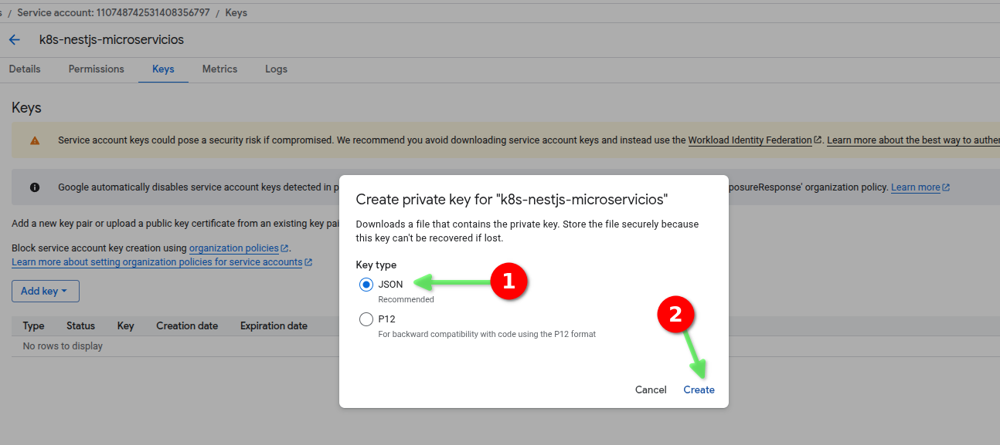

# NestJS + Microservicios: Aplicaciones escalables y modulares (parte 12)

- En este documento vamos a documentar el curso [NestJS + Microservicios: Aplicaciones escalables y modulares de Udemy](https://www.udemy.com/course/nestjs-microservicios)

## 12 Implementar Kubernetes para desplegar nuestra aplicación en un cluster de Google Kubernetes Engine

### 12.01 Introducción

- Vamos a implementar Kubernetes para desplegar nuestra aplicación en un cluster de Google Kubernetes Engine.
- Es una sección que es agnóstica de la plataforma que usemos, ya sea `AWS`, `GCP`, `Azure`, etc, excepto que usamos las imágenes de Docker ya desplegadas en Google Container Registry.

- Un Cluster de Kubernetes tiene los siguientes componentes esenciales:
  - `Master Node`: 
    - Es el nodo maestro del cluster.
    - Controla toda la infraestructura del cluster.
    - Puede tener réplicas de sí mismo para alta disponibilidad.
    - Accedemos a él mediante:
      - CLI (`kubectl` o mediante `gcloud`)
      - API REST
      - Dashboard
  - `API Server`
    - Es el componente que expone la API REST de Kubernetes.
    - Es el encargado de interactuar con el Master Node.
    - Es el encargado de interpretar las acciones que le damos mediante la CLI o el Dashboard.
  - `Controller Manager`
    - Es el componente que se encarga de controlar los nodos del cluster.
    - Es el encargado de interpretar las acciones que le damos mediante la CLI o el Dashboard.
    - Sabe lo que está sucediendo en el cluster y toma decisiones en base a eso.
  - `Scheduler`
    - Es el componente que se encarga de asignar las tareas a los nodos del cluster.
    - Es el encargado de interpretar las acciones que le damos mediante la CLI o el Dashboard.
  - `ETCD`
    - Es el componente que se encarga de almacenar la configuración del cluster.
    - Es el encargado de interpretar las acciones que le damos mediante la CLI o el Dashboard.
    - Se encarga de almacenar la configuración del cluster en forma de `key-value`.
- `Virtual Network`
  - Convierte nuestro cluster en una única máquina.
- `Worker Nodes` que son los nodos que ejecutan las aplicaciones.
  - Cada `Worker Node` tiene:
    - `Kubelet`
      - Es el componente que se encarga de ejecutar las tareas en el nodo.
    - `Kube Proxy`
      - Es el componente que se encarga de exponer los servicios del nodo.
    - `Container Runtime`
      - Es el componente que se encarga de ejecutar las tareas en el nodo.
      - En este caso usamos `containerd` que es un runtime de contenedores.
- `Pods`
  - Son las unidades básicas de código ejecutables en un cluster de Kubernetes.
  - Están compuestos por uno o más contenedores.
  - Todos los `Pods` de un mismo `Node` se ejecutan en el mismo nodo.
  - Los `Pods` son la unidad más pequeña que se puede desplegar en un cluster de Kubernetes.
  - Los `Pods` pueden estar compuestos por un solo contenedor o por múltiples contenedores que se ejecutan juntos.
- `Services`
  - Son los servicios que expone el cluster.
  - Son los servicios que permiten que las aplicaciones se comuniquen entre sí.
  - Los `Services` se encargan de exponer los `Pods` a la red.
  - Los `Services` se encargan de balancear la carga de las solicitudes entre los `Pods`.
  - Los `Services` se encargan de que los `Pods` se puedan comunicar entre sí.
- `Secrets`
  - Contiene por ejemplo las credenciales de las bases de datos.
  - Contiene por ejemplo las credenciales de autenticación de las APIs.

### 12.02 Instalación de `K8s` y `Helm`

#### 12.02.01 Configurar `Docker Desktop` para usar `Kubernetes`

- Tenemos que habilitar el Kubernetes en Docker Desktop.


- Tarda un poco en activarse.


- Tenemos que asegurarnos de que el `Kubernetes` está activado.


#### 12.02.02 Instalación de `kubectl`

- Tenemos que asegurarnos de que tenemos `kubectl` instalado ejecutando el siguiente comando:

```bash
kubectl version
Client Version: v1.32.3
Kustomize Version: v5.5.0
```

#### 12.02.03 Instalación de `Helm`

- Tenemos que asegurarnos de que tenemos `Helm` instalado ejecutando el siguiente comando:

```bash
 helm version
version.BuildInfo{Version:"v3.17.3", GitCommit:"e4da49785aa6e6ee2b86efd5dd9e43400318262b", GitTreeState:"clean", GoVersion:"go1.23.7"}
```

- Si no tenemos `Helm` instalado, lo instalamos según la documentación de [Helm](https://helm.sh) depediendo del sistema operativo que tengamos.

#### 12.02.04 Creación de la carpeta k8s donde vamos a guardar los archivos de configuración de Kubernetes

- Creamos la carpeta `k8s` en el directorio raíz del proyecto.

```bash
~/Training/microservices/nestjs-microservicios/02-Products-App$
mkdir k8s
```

- Copiamos el archivo `K8s.README.md` a la carpeta `k8s`.

#### 12.02.05 Creación del proyecto `Helm`

- Creamos el proyecto `Helm` en la carpeta `k8s`.

```bash
~/Training/microservices/nestjs-microservicios/02-Products-App/k8s$
helm create nestjs-microservicios
Creating nestjs-microservicios
```

- Vamos a ver el contenido del proyecto `Helm`.

```bash
~/Training/microservices/nestjs-microservicios/02-Products-App/k8s$
cd nestjs-microservicios/
~/Training/microservices/nestjs-microservicios/02-Products-App/k8s/nestjs-microservicios$
ls -la
total 32
drwxr-xr-x 4 juanpabloperez juanpabloperez 4096 Apr 16 17:24 .
drwxrwxr-x 3 juanpabloperez juanpabloperez 4096 Apr 16 17:24 ..
drwxr-xr-x 2 juanpabloperez juanpabloperez 4096 Apr 16 17:24 charts
-rw-r--r-- 1 juanpabloperez juanpabloperez 1157 Apr 16 17:24 Chart.yaml
-rw-r--r-- 1 juanpabloperez juanpabloperez  349 Apr 16 17:24 .helmignore
drwxr-xr-x 3 juanpabloperez juanpabloperez 4096 Apr 16 17:24 templates
-rw-r--r-- 1 juanpabloperez juanpabloperez 4307 Apr 16 17:24 values.yaml
```

- Podemos borrar el contenido del documento `values.yaml` y dejarlo en blanco.
- Podemos borrar todos los archivos de la carpeta `templates` porque vamos a empezar desde cero.

### 12.03 Creación del primer `deployment`

- Tenemos que crear la carpeta `client-gateway` en la carpeta `templates`.

```bash
~/Training/microservices/nestjs-microservicios/02-Products-App/k8s/nestjs-microservicios$
mkdir templates/client-gateway
```

- Vamos a crear el primer `deployment` para nuestro microservicio de `client-gateway`.
  - `client-gateway` es el nombre del microservicio.
  - `europe-southwest1-docker.pkg.dev/nestjs-microservicios-456909/nestjs-microservicios/client-gateway:latest` es la imagen del microservicio.
  - usamos `--dry-run=client` para que no se cree el `deployment` en el cluster.
  - usamos `-o yaml` para que se guarde el resultado en un archivo.
  - `templates/client-gateway/deployment.yaml` es el archivo de configuración del `deployment` para el microservicio `client-gateway` que se creará en el directorio `templates/client-gateway`.

```bash
~/Training/microservices/nestjs-microservicios/02-Products-App/k8s/nestjs-microservicios$
kubectl create deployment client-gateway --image=europe-southwest1-docker.pkg.dev/nestjs-microservicios-456909/nestjs-microservicios/client-gateway:latest --dry-run=client -o yaml > templates/client-gateway/deployment.yaml
```

- Vamos a ver el contenido del archivo `deployment.yaml`.

> 02-Products-App/k8s/nestjs-microservicios/templates/client-gateway/deployment.yaml

```yaml
apiVersion: apps/v1
kind: Deployment
metadata:
  creationTimestamp: null
  labels:
    app: client-gateway
  name: client-gateway
spec:
  replicas: 1
  selector:
    matchLabels:
      app: client-gateway
  strategy: {}
  template:
    metadata:
      creationTimestamp: null
      labels:
        app: client-gateway
    spec:
      containers:
      - image: europe-southwest1-docker.pkg.dev/nestjs-microservicios-456909/nestjs-microservicios/client-gateway:latest
        name: client-gateway
        resources: {}
status: {}
```

- Si hemos estado trabajando con otro proyecto con Helm, es posible que esté apuntando a otro cluster.
- Para trabajar con el cluster de Docker Desktop, tenemos que hacer lo siguiente:

```bash
~/Training/microservices/nestjs-microservicios/02-Products-App/k8s/nestjs-microservicios$
kubectl config use-context docker-desktop
Switched to context "docker-desktop".
```

- Vamos a ejecutar el comando `helm install` para instalar el `deployment` en el cluster.

```bash
~/Training/microservices/nestjs-microservicios/02-Products-App/k8s/nestjs-microservicios$
helm install nestjs-microservicios .
NAME: nestjs-microservicios
LAST DEPLOYED: Wed Apr 16 18:00:10 2025
NAMESPACE: default
STATUS: deployed
REVISION: 1
TEST SUITE: None
```

- Vamos a crear el `deployment` en el cluster.

```bash
~/Training/microservices/nestjs-microservicios/02-Products-App/k8s/nestjs-microservicios$
helm upgrade nestjs-microservicios .
Release "nestjs-microservicios" has been upgraded. Happy Helming!
NAME: nestjs-microservicios
LAST DEPLOYED: Wed Apr 16 18:01:06 2025
NAMESPACE: default
STATUS: deployed
REVISION: 2
TEST SUITE: None
```

- Vamos a ver el estado de los `pods` en el cluster.

```bash
kubectl get pods
NAME                              READY   STATUS             RESTARTS   AGE
client-gateway-7f9f5f5fff-plhb8   0/1     ImagePullBackOff   0          5m32s
```

- Vamos a ver los logs del `pod`.

```bash
kubectl logs client-gateway-7f9f5f5fff-plhb8
Error from server (BadRequest): container "client-gateway" in pod "client-gateway-7f9f5f5fff-plhb8" is waiting to start: trying and failing to pull image
```

- Tambien podemos ver los logs del `pod` utilizando `describe`.

```bash
kubectl describe pod client-gateway-7f9f5f5fff-plhb8
Name:             client-gateway-7f9f5f5fff-plhb8
Namespace:        default
Priority:         0
Service Account:  default
Node:             docker-desktop/192.168.65.9
Start Time:       Wed, 16 Apr 2025 18:00:10 +0200
Labels:           app=client-gateway
                  pod-template-hash=7f9f5f5fff
Annotations:      <none>
Status:           Pending
IP:               10.1.0.6
IPs:
  IP:           10.1.0.6
Controlled By:  ReplicaSet/client-gateway-7f9f5f5fff
Containers:
  client-gateway:
    Container ID:   
    Image:          europe-southwest1-docker.pkg.dev/nestjs-microservicios-456909/nestjs-microservicios/client-gateway:latest
    Image ID:       
    Port:           <none>
    Host Port:      <none>
    State:          Waiting
      Reason:       ImagePullBackOff
    Ready:          False
    Restart Count:  0
    Environment:    <none>
    Mounts:
      /var/run/secrets/kubernetes.io/serviceaccount from kube-api-access-n4q4l (ro)
Conditions:
  Type                        Status
  PodReadyToStartContainers   True 
  Initialized                 True 
  Ready                       False 
  ContainersReady             False 
  PodScheduled                True 
Volumes:
  kube-api-access-n4q4l:
    Type:                    Projected (a volume that contains injected data from multiple sources)
    TokenExpirationSeconds:  3607
    ConfigMapName:           kube-root-ca.crt
    ConfigMapOptional:       <nil>
    DownwardAPI:             true
QoS Class:                   BestEffort
Node-Selectors:              <none>
Tolerations:                 node.kubernetes.io/not-ready:NoExecute op=Exists for 300s
                             node.kubernetes.io/unreachable:NoExecute op=Exists for 300s
Events:
  Type     Reason     Age                     From               Message
  ----     ------     ----                    ----               -------
  Normal   Scheduled  8m29s                   default-scheduler  Successfully assigned default/client-gateway-7f9f5f5fff-plhb8 to docker-desktop
  Normal   Pulling    5m46s (x5 over 8m28s)   kubelet            Pulling image "europe-southwest1-docker.pkg.dev/nestjs-microservicios-456909/nestjs-microservicios/client-gateway:latest"
  Warning  Failed     5m45s (x5 over 8m27s)   kubelet            Failed to pull image "europe-southwest1-docker.pkg.dev/nestjs-microservicios-456909/nestjs-microservicios/client-gateway:latest": Error response from daemon: Head "https://europe-southwest1-docker.pkg.dev/v2/nestjs-microservicios-456909/nestjs-microservicios/client-gateway/manifests/latest": denied: Unauthenticated request. Unauthenticated requests do not have permission "artifactregistry.repositories.downloadArtifacts" on resource "projects/nestjs-microservicios-456909/locations/europe-southwest1/repositories/nestjs-microservicios" (or it may not exist)
  Warning  Failed     5m45s (x5 over 8m27s)   kubelet            Error: ErrImagePull
  Warning  Failed     3m23s (x20 over 8m27s)  kubelet            Error: ImagePullBackOff
  Normal   BackOff    3m8s (x21 over 8m27s)   kubelet            Back-off pulling image "europe-southwest1-docker.pkg.dev/nestjs-microservicios-456909/nestjs-microservicios/client-gateway:latest"
```

- Vemos que no se ha podido descargar la imagen del microservicio porque no tenemos credenciales para acceder al registro de contenedores de Google Container Registry.

### 12.04 Configuración de las credenciales de Google Container Registry

- Vamos a configurar las credenciales de Google Container Registry.
- Desde Google Cloud Console, vamos a la sección `IAM & Services`.


- Tenemos que crear una nueva cuenta de servicio.


- Le damos un nombre a la cuenta de servicio, por ejemplo `k8s-nestjs-microservicios`.


- Tenemos que darle permisos para que pueda acceder al registro de contenedores de Google Container Registry, es decir, `Artifact Registry Reader`.


- No tenemos que asignar `Grant users access to this service account` porque no queremos que se pueda acceder a la cuenta de servicio desde fuera del cluster.


- Tenemos que asegurarnos de que la cuenta de servicio está creada.


- Tenemos que crear una nueva clave privada para la cuenta de servicio.


- Utilizamos el formato `JSON` que se descarga automáticamente a nuestro ordenador.




- Tenemos que crearnos un secreto `docker-registry` de Kubernetes, al que vamos a llamar `gcr-json-key`, con la clave privada.
- El `docker-server` es el servidor de Docker, en este caso `europe-southwest1-docker.pkg.dev`.
- El `docker-username` es el nombre de la cuenta de servicio, en este caso `_json_key`.
- El `docker-password` es el contenido del archivo `key.json` que hemos descargado en el paso anterior.
- El `docker-email` es el email de la cuenta de servicio, en este caso `juan.xxxx.2025@gmail.com`.

```bash
~/Training/microservices/nestjs-microservicios/02-Products-App/k8s/nestjs-microservicios$
kubectl create secret docker-registry gcr-json-key --docker-server=europe-southwest1-docker.pkg.dev --docker-username=_json_key --docker-password="$(cat '/home/juanpabloperez/Downloads/nestjs-microservicios-456909-46e7b7a8ab62.json')" --docker-email=juan.xxxx.2025@gmail.com
secret/gcr-json-key created
```

- Tenemos que utilizar `kubectl patch` para añadir el secreto al service account `default`.

```bash
~/Training/microservices/nestjs-microservicios/02-Products-App/k8s/nestjs-microservicios$
 kubectl patch serviceaccount default --patch '{"imagePullSecrets":[{"name":"gcr-json-key"}]}'
serviceaccount/default patched
```

- Tenemos que hacer un `rollout` para que se apliquen los cambios.

```bash
~/Training/microservices/nestjs-microservicios/02-Products-App/k8s/nestjs-microservicios$
kubectl rollout restart deployment
deployment.apps/client-gateway restarted
```

- Tenemos que ver el estado de los `pods` en el cluster.

```bash
~/Training/microservices/nestjs-microservicios/02-Products-App/k8s/nestjs-microservicios$
kubectl get pods
NAME                              READY   STATUS             RESTARTS      AGE
client-gateway-58b8d577f5-ptg2p   0/1     CrashLoopBackOff   2 (24s ago)   53s
```

- Vamos a ver los logs del `pod`.

```bash
kubectl describe pod client-gateway-58b8d577f5-ptg2p
Name:             client-gateway-58b8d577f5-ptg2p
Namespace:        default
Priority:         0
Service Account:  default
Node:             docker-desktop/192.168.65.9
Start Time:       Wed, 16 Apr 2025 19:05:09 +0200
Labels:           app=client-gateway
                  pod-template-hash=58b8d577f5
Annotations:      kubectl.kubernetes.io/restartedAt: 2025-04-16T19:05:09+02:00
Status:           Running
IP:               10.1.0.7
IPs:
  IP:           10.1.0.7
Controlled By:  ReplicaSet/client-gateway-58b8d577f5
Containers:
  client-gateway:
    Container ID:   docker://0db199886ae9c72e4099694eb07e189ce32b190169ed332e0d7f52fd95b57d5b
    Image:          europe-southwest1-docker.pkg.dev/nestjs-microservicios-456909/nestjs-microservicios/client-gateway:latest
    Image ID:       docker-pullable://europe-southwest1-docker.pkg.dev/nestjs-microservicios-456909/nestjs-microservicios/client-gateway@sha256:53db3955b89cb4de61f5a5fff0a1a4a67496ad074035291437e2c01850383e4c
    Port:           <none>
    Host Port:      <none>
    State:          Terminated
      Reason:       Error
      Exit Code:    1
      Started:      Wed, 16 Apr 2025 19:06:59 +0200
      Finished:     Wed, 16 Apr 2025 19:07:00 +0200
    Last State:     Terminated
      Reason:       Error
      Exit Code:    1
      Started:      Wed, 16 Apr 2025 19:06:06 +0200
      Finished:     Wed, 16 Apr 2025 19:06:07 +0200
    Ready:          False
    Restart Count:  4
    Environment:    <none>
    Mounts:
      /var/run/secrets/kubernetes.io/serviceaccount from kube-api-access-4sbgj (ro)
Conditions:
  Type                        Status
  PodReadyToStartContainers   True 
  Initialized                 True 
  Ready                       False 
  ContainersReady             False 
  PodScheduled                True 
Volumes:
  kube-api-access-4sbgj:
    Type:                    Projected (a volume that contains injected data from multiple sources)
    TokenExpirationSeconds:  3607
    ConfigMapName:           kube-root-ca.crt
    ConfigMapOptional:       <nil>
    DownwardAPI:             true
QoS Class:                   BestEffort
Node-Selectors:              <none>
Tolerations:                 node.kubernetes.io/not-ready:NoExecute op=Exists for 300s
                             node.kubernetes.io/unreachable:NoExecute op=Exists for 300s
Events:
  Type     Reason     Age                 From               Message
  ----     ------     ----                ----               -------
  Normal   Scheduled  2m4s                default-scheduler  Successfully assigned default/client-gateway-58b8d577f5-ptg2p to docker-desktop
  Normal   Pulled     118s                kubelet            Successfully pulled image "europe-southwest1-docker.pkg.dev/nestjs-microservicios-456909/nestjs-microservicios/client-gateway:latest" in 5.089s (5.089s including waiting). Image size: 185344836 bytes.
  Normal   Pulled     115s                kubelet            Successfully pulled image "europe-southwest1-docker.pkg.dev/nestjs-microservicios-456909/nestjs-microservicios/client-gateway:latest" in 1.048s (1.048s including waiting). Image size: 185344836 bytes.
  Normal   Pulled     96s                 kubelet            Successfully pulled image "europe-southwest1-docker.pkg.dev/nestjs-microservicios-456909/nestjs-microservicios/client-gateway:latest" in 918ms (918ms including waiting). Image size: 185344836 bytes.
  Normal   Pulled     67s                 kubelet            Successfully pulled image "europe-southwest1-docker.pkg.dev/nestjs-microservicios-456909/nestjs-microservicios/client-gateway:latest" in 890ms (890ms including waiting). Image size: 185344836 bytes.
  Normal   Pulling    16s (x5 over 2m3s)  kubelet            Pulling image "europe-southwest1-docker.pkg.dev/nestjs-microservicios-456909/nestjs-microservicios/client-gateway:latest"
  Normal   Created    15s (x5 over 118s)  kubelet            Created container: client-gateway
  Normal   Pulled     15s                 kubelet            Successfully pulled image "europe-southwest1-docker.pkg.dev/nestjs-microservicios-456909/nestjs-microservicios/client-gateway:latest" in 949ms (949ms including waiting). Image size: 185344836 bytes.
  Normal   Started    14s (x5 over 118s)  kubelet            Started container client-gateway
  Warning  BackOff    12s (x9 over 113s)  kubelet            Back-off restarting failed container client-gateway in pod client-gateway-58b8d577f5-ptg2p_default(95ce859f-2986-4bc3-af74-1d3fdb9144eb)
```

- Vemos que la imagen se descargó correctamente, pero el contenedor no se ha podido iniciar.
- Vamos a ver los logs del pod.

```bash
kubectl logs client-gateway-58b8d577f5-ptg2p
/usr/src/app/dist/config/envs.js:17
    throw new Error(`Config validation error: ${error.message}`);
    ^

Error: Config validation error: "PORT" is required
    at Object.<anonymous> (/usr/src/app/dist/config/envs.js:17:11)
    at Module._compile (node:internal/modules/cjs/loader:1554:14)
    at Object..js (node:internal/modules/cjs/loader:1706:10)
    at Module.load (node:internal/modules/cjs/loader:1289:32)
    at Function._load (node:internal/modules/cjs/loader:1108:12)
    at TracingChannel.traceSync (node:diagnostics_channel:322:14)
    at wrapModuleLoad (node:internal/modules/cjs/loader:220:24)
    at Module.require (node:internal/modules/cjs/loader:1311:12)
    at require (node:internal/modules/helpers:136:16)
    at Object.<anonymous> (/usr/src/app/dist/config/index.js:17:14)

Node.js v22.14.0
```

- Vemos que el error es que no se ha podido iniciar el contenedor porque no se ha podido cargar la variable de entorno `PORT`.

### 12.05 Configuración de las variables de entorno

- Tenemos que modificar el archivo `/templates/client-gateway/deployment.yaml` para añadir las variables de entorno.

> 02-Products-App/k8s/nestjs-microservicios/templates/client-gateway/deployment.yaml

```diff
.
  spec:
    containers:
    - image: europe-southwest1-docker.pkg.dev/nestjs-microservicios-456909/nestjs-microservicios/client-gateway:latest
      name: client-gateway
      resources: {}
+     env:
+       - name: PORT
+       value: "3000"
status: {}
```

- Vamos a hacer un `upgrade` para que se apliquen los cambios.

```bash
helm upgrade nestjs-microservicios .
Release "nestjs-microservicios" has been upgraded. Happy Helming!
NAME: nestjs-microservicios
LAST DEPLOYED: Wed Apr 16 19:14:43 2025
NAMESPACE: default
STATUS: deployed
REVISION: 3
TEST SUITE: None
```

- Vamos a ver el estado de los `pods` en el cluster.

```bash
kubectl get pods
NAME                             READY   STATUS   RESTARTS      AGE
client-gateway-b7f5bcc45-bj527   0/1     Error    2 (17s ago)   22s
```

- Vamos a ver los logs del `pod`.

```bash
kubectl logs client-gateway-b7f5bcc45-bj527
/usr/src/app/dist/config/envs.js:17
    throw new Error(`Config validation error: ${error.message}`);
    ^

Error: Config validation error: "NATS_SERVERS" is required
    at Object.<anonymous> (/usr/src/app/dist/config/envs.js:17:11)
    at Module._compile (node:internal/modules/cjs/loader:1554:14)
    at Object..js (node:internal/modules/cjs/loader:1706:10)
    at Module.load (node:internal/modules/cjs/loader:1289:32)
    at Function._load (node:internal/modules/cjs/loader:1108:12)
    at TracingChannel.traceSync (node:diagnostics_channel:322:14)
    at wrapModuleLoad (node:internal/modules/cjs/loader:220:24)
    at Module.require (node:internal/modules/cjs/loader:1311:12)
    at require (node:internal/modules/helpers:136:16)
    at Object.<anonymous> (/usr/src/app/dist/config/index.js:17:14)

Node.js v22.14.0
```

- Vemos que el error es que no se ha podido iniciar el contenedor porque no se ha podido cargar la variable de entorno `NATS_SERVERS`.
- Tenemos que modificar el archivo `/templates/client-gateway/deployment.yaml` para añadir la variable de entorno `NATS_SERVERS`.

> 02-Products-App/k8s/nestjs-microservicios/templates/client-gateway/deployment.yaml

```diff
.
  spec:
    containers:
      - image: europe-southwest1-docker.pkg.dev/nestjs-microservicios-456909/nestjs-microservicios/client-gateway:latest
        name: client-gateway
        resources: {}
        env:
          - name: PORT
            value: "3000"
+         - name: NATS_SERVERS
+           value: "nats://nats-server:6222"
status: {}
```

- Vamos a hacer un `upgrade` para que se apliquen los cambios.

```bash
helm upgrade nestjs-microservicios .
Release "nestjs-microservicios" has been upgraded. Happy Helming!
NAME: nestjs-microservicios
LAST DEPLOYED: Wed Apr 16 19:21:22 2025
NAMESPACE: default
STATUS: deployed
REVISION: 5
TEST SUITE: None
```

- Vamos a ver el estado de los `pods` en el cluster.

```bash
kubectl get pods
NAME                             READY   STATUS    RESTARTS   AGE
client-gateway-646498669-rnvcl   1/1     Running   0          21s
```

- Vamos a ver los logs del `pod`.

```bash
kubectl logs client-gateway-646498669-rnvcl
[Nest] 1  - 04/16/2025, 5:21:24 PM     LOG [NestFactory] Starting Nest application...
[Nest] 1  - 04/16/2025, 5:21:24 PM     LOG [InstanceLoader] AppModule dependencies initialized +12ms
[Nest] 1  - 04/16/2025, 5:21:24 PM     LOG [InstanceLoader] NatsModule dependencies initialized +0ms
[Nest] 1  - 04/16/2025, 5:21:24 PM     LOG [InstanceLoader] ClientsModule dependencies initialized +0ms
[Nest] 1  - 04/16/2025, 5:21:24 PM     LOG [InstanceLoader] ProductsModule dependencies initialized +1ms
[Nest] 1  - 04/16/2025, 5:21:24 PM     LOG [InstanceLoader] OrdersModule dependencies initialized +0ms
[Nest] 1  - 04/16/2025, 5:21:24 PM     LOG [InstanceLoader] AuthModule dependencies initialized +0ms
[Nest] 1  - 04/16/2025, 5:21:24 PM     LOG [RoutesResolver] ProductsController {/api/products}: +6ms
[Nest] 1  - 04/16/2025, 5:21:24 PM     LOG [RouterExplorer] Mapped {/api/products, POST} route +3ms
[Nest] 1  - 04/16/2025, 5:21:24 PM     LOG [RouterExplorer] Mapped {/api/products, GET} route +1ms
[Nest] 1  - 04/16/2025, 5:21:24 PM     LOG [RouterExplorer] Mapped {/api/products/:id, GET} route +2ms
[Nest] 1  - 04/16/2025, 5:21:24 PM     LOG [RouterExplorer] Mapped {/api/products/:id, DELETE} route +0ms
[Nest] 1  - 04/16/2025, 5:21:24 PM     LOG [RouterExplorer] Mapped {/api/products/:id, PATCH} route +1ms
[Nest] 1  - 04/16/2025, 5:21:24 PM     LOG [RoutesResolver] OrdersController {/api/orders}: +0ms
[Nest] 1  - 04/16/2025, 5:21:24 PM     LOG [RouterExplorer] Mapped {/api/orders, POST} route +0ms
[Nest] 1  - 04/16/2025, 5:21:24 PM     LOG [RouterExplorer] Mapped {/api/orders, GET} route +1ms
[Nest] 1  - 04/16/2025, 5:21:24 PM     LOG [RouterExplorer] Mapped {/api/orders/:status, GET} route +0ms
[Nest] 1  - 04/16/2025, 5:21:24 PM     LOG [RouterExplorer] Mapped {/api/orders/id/:id, GET} route +1ms
[Nest] 1  - 04/16/2025, 5:21:24 PM     LOG [RouterExplorer] Mapped {/api/orders/:id, PATCH} route +1ms
[Nest] 1  - 04/16/2025, 5:21:24 PM     LOG [RoutesResolver] AuthController {/api/auth}: +0ms
[Nest] 1  - 04/16/2025, 5:21:24 PM     LOG [RouterExplorer] Mapped {/api/auth/register, POST} route +0ms
[Nest] 1  - 04/16/2025, 5:21:24 PM     LOG [RouterExplorer] Mapped {/api/auth/login, POST} route +0ms
[Nest] 1  - 04/16/2025, 5:21:24 PM     LOG [RouterExplorer] Mapped {/api/auth/verify, GET} route +1ms
[Nest] 1  - 04/16/2025, 5:21:24 PM     LOG [NestApplication] Nest application successfully started +3ms
[Nest] 1  - 04/16/2025, 5:21:24 PM     LOG [Main-Gateway] Gateway running on port 3000
```

